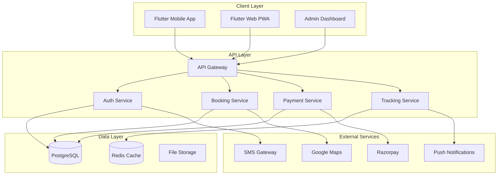

# 🚀 LuhaRide - Complete Development Roadmap

## 📋 Project Overview

**Goal:** Legal taxi aggregator platform for Uttarakhand with seat-wise booking system

**Timeline:** 6-8 months to MVP launch  
**Team Size:** 1-3 developers  
**Architecture:** Flutter (Mobile) + Node.js (Backend) + PostgreSQL (Database)

---

## 🎯 Development Philosophy

### Core Principles:
1. **MVP First** - Launch with essential features, add advanced features later
2. **Security First** - Authentication, data encryption, legal compliance
3. **User Experience** - Simple, intuitive, fast
4. **Scalability** - Build for 1000+ concurrent users
5. **Legal Compliance** - Motor Vehicle Act compliant, only yellow-plate taxis

### Success Metrics:
- App rating: >4.5 stars
- Zero overcrowding incidents
- On-time departure: >90%
- Booking completion rate: >80%
- Server uptime: >99.5%

---

## 📊 System Architecture



---

## 🏗️ PHASE 1: Foundation & Authentication (Weeks 1-3)

### Week 1: Backend Foundation

#### 1.1 Project Setup Enhancement
**Status:** ✅ Base setup complete, needs enhancement

**Tasks:**
- [x] Basic folder structure created
- [ ] Add API versioning (`/api/v1/`)
- [ ] Setup logging (Winston)
- [ ] Add request validation (Joi/Yup)
- [ ] Setup error codes system
- [ ] Add API documentation (Swagger)

**Files to create:**
```
backend/
├── src/
│   ├── utils/
│   │   ├── logger.js           # Winston logger setup
│   │   ├── ApiError.js         # Custom error class
│   │   ├── ApiResponse.js      # Standard response format
│   │   └── constants.js        # Error codes, messages
│   ├── validators/
│   │   └── validation.js       # Joi validation schemas
│   └── docs/
│       └── swagger.yaml        # API documentation
```

**Deliverables:**
- Structured logging system
- Standardized API responses
- Error handling framework
- API documentation foundation

---

#### 1.2 Authentication System Design

**Database Schema Enhancement:**

```sql
-- Users table (already created, may need enhancements)
ALTER TABLE users ADD COLUMN IF NOT EXISTS phone_verified BOOLEAN DEFAULT false;
ALTER TABLE users ADD COLUMN IF NOT EXISTS last_login_at TIMESTAMP;
ALTER TABLE users ADD COLUMN IF NOT EXISTS login_attempts INTEGER DEFAULT 0;
ALTER TABLE users ADD COLUMN IF NOT EXISTS blocked_until TIMESTAMP;

-- OTP Management
CREATE TABLE otp_verifications (
    id UUID PRIMARY KEY DEFAULT gen_random_uuid(),
    phone VARCHAR(15) NOT NULL,
    otp VARCHAR(6) NOT NULL,
    purpose VARCHAR(20) NOT NULL, -- registration, login, password_reset
    attempts INTEGER DEFAULT 0,
    is_verified BOOLEAN DEFAULT false,
    expires_at TIMESTAMP NOT NULL,
    created_at TIMESTAMP DEFAULT NOW()
);

-- Refresh tokens for JWT
CREATE TABLE refresh_tokens (
    id UUID PRIMARY KEY DEFAULT gen_random_uuid(),
    user_id UUID REFERENCES users(id) NOT NULL,
    token TEXT NOT NULL,
    device_info JSONB,
    expires_at TIMESTAMP NOT NULL,
    is_revoked BOOLEAN DEFAULT false,
    created_at TIMESTAMP DEFAULT NOW()
);

-- Login history
CREATE TABLE login_history (
    id UUID PRIMARY KEY DEFAULT gen_random_uuid(),
    user_id UUID REFERENCES users(id) NOT NULL,
    login_method VARCHAR(20), -- otp, password
    ip_address VARCHAR(45),
    user_agent TEXT,
    login_status VARCHAR(20), -- success, failed, blocked
    created_at TIMESTAMP DEFAULT NOW()
);

-- Indexes
CREATE INDEX idx_otp_phone ON otp_verifications(phone);
CREATE INDEX idx_otp_expires ON otp_verifications(expires_at);
CREATE INDEX idx_refresh_tokens_user ON refresh_tokens(user_id);
CREATE INDEX idx_login_history_user ON login_history(user_id);
```

**API Endpoints:**

```
Auth Module:
├── POST   /api/v1/auth/send-otp
│   Body: { phone, purpose: "registration|login" }
│   Response: { message, expiresIn }
│
├── POST   /api/v1/auth/verify-otp
│   Body: { phone, otp, purpose }
│   Response: { token, refreshToken, user }
│
├── POST   /api/v1/auth/register
│   Body: { phone, otp, name, role, email? }
│   Response: { token, refreshToken, user }
│
├── POST   /api/v1/auth/login
│   Body: { phone, otp }
│   Response: { token, refreshToken, user }
│
├── POST   /api/v1/auth/refresh-token
│   Body: { refreshToken }
│   Response: { token, refreshToken }
│
├── POST   /api/v1/auth/logout
│   Headers: Authorization: Bearer <token>
│   Response: { message }
│
└── GET    /api/v1/auth/me
    Headers: Authorization: Bearer <token>
    Response: { user }
```

**Implementation Files:**

```javascript
// backend/src/controllers/authController.js
class AuthController {
  async sendOTP(req, res, next)          // Generate & send OTP
  async verifyOTP(req, res, next)        // Verify OTP
  async register(req, res, next)         // New user registration
  async login(req, res, next)            // User login
  async refreshToken(req, res, next)     // Refresh JWT
  async logout(req, res, next)           // Logout & revoke tokens
  async getProfile(req, res, next)       // Get current user
}

// backend/src/services/smsService.js
class SMSService {
  async sendOTP(phone, otp)              // Twilio integration
  async sendNotification(phone, message) // General SMS
}

// backend/src/services/otpService.js
class OTPService {
  generateOTP()                          // Generate 6-digit OTP
  async saveOTP(phone, otp, purpose)     // Store in DB
  async verifyOTP(phone, otp, purpose)   // Check validity
  async cleanExpiredOTPs()               // Cleanup job
}

// backend/src/services/tokenService.js
class TokenService {
  generateAccessToken(user)              // Create JWT
  generateRefreshToken(user)             // Create refresh token
  async saveRefreshToken(userId, token)  // Store in DB
  async revokeToken(token)               // Invalidate token
  verifyToken(token)                     // Validate JWT
}

// backend/src/middleware/auth.js
const authMiddleware = (req, res, next) => {
  // Verify JWT token
  // Attach user to req.user
}

const roleMiddleware = (...roles) => (req, res, next) => {
  // Check if user has required role
}
```

**Security Features:**
- Rate limiting (max 3 OTP requests per phone per hour)
- OTP expires after 5 minutes
- Max 3 verification attempts
- Account blocking after 5 failed login attempts
- JWT expires after 7 days
- Refresh token rotation
- Device fingerprinting

**Deliverables:**
- Complete authentication system
- OTP generation & verification
- JWT token management
- Role-based access control
- Rate limiting & security

---

### Week 2: User Management & Profiles

#### 2.1 User Profile Management

**API Endpoints:**

```
User Module:
├── GET    /api/v1/users/profile
│   Response: { user, stats }
│
├── PUT    /api/v1/users/profile
│   Body: { name, email, profileImage? }
│   Response: { user }
│
├── POST   /api/v1/users/profile/image
│   Body: FormData with image
│   Response: { imageUrl }
│
├── GET    /api/v1/users/emergency-contacts
│   Response: { contacts[] }
│
├── POST   /api/v1/users/emergency-contacts
│   Body: { name, phone, relationship }
│   Response: { contact }
│
└── DELETE /api/v1/users/emergency-contacts/:id
    Response: { message }
```

**Database Schema:**

```sql
CREATE TABLE emergency_contacts (
    id UUID PRIMARY KEY DEFAULT gen_random_uuid(),
    user_id UUID REFERENCES users(id) NOT NULL,
    name VARCHAR(100) NOT NULL,
    phone VARCHAR(15) NOT NULL,
    relationship VARCHAR(50),
    is_primary BOOLEAN DEFAULT false,
    created_at TIMESTAMP DEFAULT NOW()
);
```

#### 2.2 Driver Verification System

**API Endpoints:**

```
Driver Verification:
├── POST   /api/v1/drivers/documents
│   Body: FormData { documentType, file, expiryDate? }
│   Response: { document }
│
├── GET    /api/v1/drivers/documents
│   Response: { documents[], verificationStatus }
│
├── GET    /api/v1/drivers/verification-status
│   Response: { status, pendingDocuments[], rejectedDocuments[] }
│
└── POST   /api/v1/drivers/submit-for-verification
    Response: { message, estimatedReviewTime }
```

**Document Types:**
- Driving License (with badge number)
- Vehicle RC
- Insurance Certificate
- Fitness Certificate
- PUC Certificate
- Police Verification
- Aadhaar Card
- PAN Card

**Verification Flow:**
```
1. Driver uploads documents → Pending
2. OCR scan for basic validation
3. Union admin/Platform reviews
4. Approve/Reject with reason
5. Driver notified
```

---

### Week 3: Mobile App - Authentication UI

#### 3.1 Flutter App Structure

**Folder Structure:**

```
mobile/lib/
├── main.dart
├── app.dart
│
├── core/
│   ├── config/
│   │   ├── app_config.dart
│   │   ├── route_config.dart
│   │   └── theme_config.dart
│   ├── constants/
│   │   ├── api_constants.dart
│   │   ├── app_constants.dart
│   │   └── asset_constants.dart
│   ├── theme/
│   │   ├── app_theme.dart
│   │   ├── app_colors.dart
│   │   └── app_text_styles.dart
│   └── utils/
│       ├── validators.dart
│       ├── formatters.dart
│       └── helpers.dart
│
├── data/
│   ├── models/
│   │   ├── user_model.dart
│   │   ├── auth_response_model.dart
│   │   └── api_response_model.dart
│   ├── repositories/
│   │   └── auth_repository.dart
│   └── services/
│       ├── api_service.dart
│       ├── storage_service.dart
│       └── auth_service.dart
│
├── presentation/
│   ├── screens/
│   │   └── auth/
│   │       ├── welcome_screen.dart
│   │       ├── role_selection_screen.dart
│   │       ├── phone_input_screen.dart
│   │       ├── otp_verification_screen.dart
│   │       ├── registration_screen.dart
│   │       └── profile_setup_screen.dart
│   └── widgets/
│       ├── common/
│       │   ├── custom_button.dart
│       │   ├── custom_text_field.dart
│       │   ├── loading_indicator.dart
│       │   └── error_widget.dart
│       └── auth/
│           ├── phone_input_widget.dart
│           └── otp_input_widget.dart
│
└── providers/
    ├── auth_provider.dart
    └── user_provider.dart
```

#### 3.2 Authentication Screens

**1. Welcome Screen:**
- App logo and branding
- "Get Started" button
- "Already have account? Login"

**2. Role Selection:**
- Three cards: Passenger, Driver, Union Admin
- Clear descriptions
- Visual icons

**3. Phone Input:**
- Country code selector (+91)
- Phone number input (10 digits)
- Terms & conditions checkbox
- "Send OTP" button
- Input validation

**4. OTP Verification:**
- 6-digit OTP input
- Auto-focus next field
- Auto-read SMS (Android)
- Resend OTP (disabled for 30s)
- Timer countdown
- Verify button

**5. Registration (New Users):**
- Name input
- Email (optional)
- Profile photo upload
- Submit button

**6. Profile Setup (Role-specific):**

**For Passengers:**
- Add emergency contact
- Enable notifications
- Location permissions

**For Drivers:**
- Upload documents
- Vehicle selection
- Union affiliation

**Implementation Example:**

```dart
// mobile/lib/presentation/screens/auth/phone_input_screen.dart
class PhoneInputScreen extends StatefulWidget {
  @override
  _PhoneInputScreenState createState() => _PhoneInputScreenState();
}

class _PhoneInputScreenState extends State<PhoneInputScreen> {
  final _formKey = GlobalKey<FormState>();
  final _phoneController = TextEditingController();
  bool _isLoading = false;
  bool _agreedToTerms = false;

  Future<void> _sendOTP() async {
    if (!_formKey.currentState!.validate()) return;
    if (!_agreedToTerms) {
      // Show error
      return;
    }

    setState(() => _isLoading = true);
    
    try {
      final authProvider = context.read<AuthProvider>();
      await authProvider.sendOTP(_phoneController.text);
      
      // Navigate to OTP screen
      Navigator.pushNamed(
        context,
        '/otp-verification',
        arguments: _phoneController.text,
      );
    } catch (e) {
      // Show error
    } finally {
      setState(() => _isLoading = false);
    }
  }

  @override
  Widget build(BuildContext context) {
    return Scaffold(
      appBar: AppBar(title: Text('Enter Phone Number')),
      body: Form(
        key: _formKey,
        child: Column(
          children: [
            // Phone input field
            // Terms checkbox
            // Send OTP button
          ],
        ),
      ),
    );
  }
}
```

**State Management (Provider):**

```dart
// mobile/lib/providers/auth_provider.dart
class AuthProvider with ChangeNotifier {
  final AuthRepository _authRepository;
  
  User? _currentUser;
  bool _isAuthenticated = false;
  
  User? get currentUser => _currentUser;
  bool get isAuthenticated => _isAuthenticated;

  Future<void> sendOTP(String phone) async {
    final response = await _authRepository.sendOTP(phone);
    // Handle response
    notifyListeners();
  }

  Future<void> verifyOTP(String phone, String otp) async {
    final response = await _authRepository.verifyOTP(phone, otp);
    if (response.token != null) {
      await _storageService.saveToken(response.token);
      _currentUser = response.user;
      _isAuthenticated = true;
      notifyListeners();
    }
  }

  Future<void> logout() async {
    await _authRepository.logout();
    await _storageService.clearToken();
    _currentUser = null;
    _isAuthenticated = false;
    notifyListeners();
  }
}
```

**Deliverables:**
- Complete authentication UI
- State management setup
- API integration
- Form validation
- Error handling
- Loading states

---

## 🏗️ PHASE 2: Core Booking System (Weeks 4-7)

### Week 4: Route & Vehicle Management

#### 4.1 Routes Management API

**API Endpoints:**

```
Routes Module:
├── GET    /api/v1/routes
│   Query: ?popular=true&from=Dehradun&to=Mussoorie
│   Response: { routes[] }
│
├── GET    /api/v1/routes/:id
│   Response: { route, availableTrips[] }
│
├── GET    /api/v1/routes/search
│   Query: ?from=Dehradun&to=Mussoorie&date=2026-02-15
│   Response: { routes[], trips[] }
│
└── GET    /api/v1/routes/popular
    Response: { routes[] }
```

#### 4.2 Vehicle Management API

**API Endpoints:**

```
Vehicle Module (Driver/Union):
├── POST   /api/v1/vehicles
│   Body: { registrationNumber, vehicleType, capacity, documents }
│   Response: { vehicle }
│
├── GET    /api/v1/vehicles
│   Response: { vehicles[] }
│
├── PUT    /api/v1/vehicles/:id
│   Body: { updates }
│   Response: { vehicle }
│
└── GET    /api/v1/vehicles/:id/documents
    Response: { documents[], expiryAlerts[] }
```

**Vehicle Verification Flow:**
1. Driver/Union submits vehicle details
2. Upload RC, insurance, fitness, PUC
3. OCR validation (plate color = yellow)
4. Union/Admin approval
5. Vehicle activated

---

### Week 5-6: Trip & Booking System

#### 5.1 Trip Management

**Database Schema Enhancement:**

```sql
-- Add seat layout configuration
CREATE TABLE seat_layouts (
    id UUID PRIMARY KEY DEFAULT gen_random_uuid(),
    vehicle_type VARCHAR(50) NOT NULL,
    total_seats INTEGER NOT NULL,
    layout_config JSONB NOT NULL, -- Seat positions, numbers
    created_at TIMESTAMP DEFAULT NOW()
);

-- Example layout_config:
{
  "rows": 4,
  "seatsPerRow": [3, 3, 3, 1],
  "seatNumbers": [1,2,3,4,5,6,7,8,9,10],
  "windowSeats": [1,3,4,6,7,9]
}
```

**API Endpoints:**

```
Trip Module:
├── POST   /api/v1/trips (Driver/Union only)
│   Body: {
│     vehicleId,
│     routeId,
│     departureTime,
│     farePerSeat,
│     notes?
│   }
│   Response: { trip }
│
├── GET    /api/v1/trips/available
│   Query: ?routeId=xxx&date=2026-02-15
│   Response: { trips[] }
│
├── GET    /api/v1/trips/:id
│   Response: { trip, seatAvailability, bookings[] }
│
├── GET    /api/v1/trips/:id/seats
│   Response: {
│     totalSeats,
│     bookedSeats: [1,3,5],
│     availableSeats: [2,4,6,7,8,9,10],
│     seatLayout
│   }
│
└── PUT    /api/v1/trips/:id/cancel (Driver/Union only)
    Body: { reason }
    Response: { message, refunds[] }
```

#### 5.2 Booking System (Core Feature)

**Booking Flow:**

```
1. Passenger searches route + date
2. Selects trip
3. Views seat layout (visual selection)
4. Selects seat(s) - max 4 seats
5. Enters passenger details
6. Reviews booking summary
7. Proceeds to payment
8. Payment success → Booking confirmed + QR code
9. SMS/Push notification sent
```

**API Endpoints:**

```
Booking Module:
├── POST   /api/v1/bookings/check-availability
│   Body: { tripId, seatNumbers[] }
│   Response: { available: boolean, unavailableSeats[] }
│
├── POST   /api/v1/bookings/hold-seat
│   Body: { tripId, seatNumbers[] }
│   Response: { holdId, expiresAt } // 5 min hold
│
├── POST   /api/v1/bookings/create
│   Body: {
│     tripId,
│     seatNumbers[],
│     holdId,
│     passengerDetails: {
│       name, phone, pickupLocation?, dropoffLocation?
│     }
│   }
│   Response: { booking, paymentDetails }
│
├── GET    /api/v1/bookings/:id
│   Response: { booking, trip, qrCode }
│
├── GET    /api/v1/bookings/user/:userId
│   Query: ?status=upcoming|completed|cancelled
│   Response: { bookings[] }
│
├── PUT    /api/v1/bookings/:id/cancel
│   Body: { reason }
│   Response: { message, refundAmount, refundETA }
│
└── GET    /api/v1/bookings/:id/qr-code
    Response: { qrCode (base64) }
```

**Implementation Details:**

```javascript
// backend/src/controllers/bookingController.js
class BookingController {
  async checkAvailability(req, res, next) {
    const { tripId, seatNumbers } = req.body;
    
    // Check if seats are available using atomic query
    const availableSeats = await Booking.checkSeatsAvailability(
      tripId,
      seatNumbers
    );
    
    res.json({ available: availableSeats.length === seatNumbers.length });
  }

  async holdSeat(req, res, next) {
    const { tripId, seatNumbers } = req.body;
    
    // Create temporary hold (5 minutes)
    const hold = await redis.setex(
      `seat-hold:${tripId}:${seatNumbers.join(',')}`,
      300, // 5 minutes
      JSON.stringify({ userId: req.user.id, seatNumbers })
    );
    
    res.json({
      holdId: hold.id,
      expiresAt: Date.now() + 300000
    });
  }

  async createBooking(req, res, next) {
    const { tripId, seatNumbers, holdId, passengerDetails } = req.body;
    
    // Use transaction to ensure atomicity
    const booking = await db.transaction(async (trx) => {
      // Verify hold is still valid
      const hold = await redis.get(`seat-hold:${holdId}`);
      if (!hold) throw new Error('Seat hold expired');
      
      // Double-check seat availability
      const available = await Booking.checkSeatsAvailability(
        tripId,
        seatNumbers,
        trx
      );
      
      if (available.length !== seatNumbers.length) {
        throw new Error('Seats no longer available');
      }
      
      // Create bookings (one per seat)
      const bookings = [];
      for (const seatNumber of seatNumbers) {
        const booking = await Booking.create({
          tripId,
          passengerId: req.user.id,
          seatNumber,
          fare: trip.farePerSeat,
          status: 'pending',
          bookingCode: generateBookingCode(),
          ...passengerDetails
        }, trx);
        
        bookings.push(booking);
      }
      
      // Update trip booked seats count
      await Trip.increment('seats_booked', {
        by: seatNumbers.length,
        where: { id: tripId }
      }, trx);
      
      // Generate QR code
      const qrCode = await QRService.generate(bookings[0].id);
      await Booking.update(
        { qr_code: qrCode },
        { where: { id: bookings[0].id } },
        trx
      );
      
      // Release hold
      await redis.del(`seat-hold:${holdId}`);
      
      return bookings[0];
    });
    
    // Send confirmation SMS
    await SMSService.sendBookingConfirmation(
      passengerDetails.phone,
      booking.bookingCode
    );
    
    res.json({ booking });
  }
}
```

**QR Code Generation:**

```javascript
// backend/src/services/qrService.js
const QRCode = require('qrcode');

class QRService {
  async generate(bookingId) {
    const data = {
      bookingId,
      timestamp: Date.now(),
      signature: this.generateSignature(bookingId)
    };
    
    const qrCode = await QRCode.toDataURL(JSON.stringify(data), {
      errorCorrectionLevel: 'H',
      width: 300
    });
    
    return qrCode;
  }
  
  async verify(qrData) {
    const data = JSON.parse(qrData);
    
    // Verify signature
    const isValid = this.verifySignature(data.bookingId, data.signature);
    if (!isValid) return false;
    
    // Check booking exists and is valid
    const booking = await Booking.findByPk(data.bookingId);
    return booking && booking.status === 'confirmed';
  }
  
  generateSignature(bookingId) {
    const crypto = require('crypto');
    return crypto
      .createHmac('sha256', process.env.QR_SECRET)
      .update(bookingId)
      .digest('hex');
  }
}
```

**Seat Hold & Concurrency:**

```javascript
// Prevent double booking with Redis locks
async function holdSeatsWithLock(tripId, seatNumbers) {
  const lockKey = `trip-lock:${tripId}`;
  const lock = await redisLock.acquire(lockKey, 5000); // 5 second lock
  
  try {
    // Check availability
    const available = await checkSeats(tripId, seatNumbers);
    
    if (available) {
      // Create hold
      await createSeatHold(tripId, seatNumbers);
      return true;
    }
    
    return false;
  } finally {
    await lock.release();
  }
}
```

---

### Week 7: Mobile App - Booking UI

#### 7.1 Search & Browse Screens

**1. Home Screen (Passenger):**
```dart
class PassengerHomeScreen extends StatelessWidget {
  @override
  Widget build(BuildContext context) {
    return Scaffold(
      body: Column(
        children: [
          // Header with user info
          UserHeader(),
          
          // Quick route search
          RouteSearchCard(
            fromController: _fromController,
            toController: _toController,
            onSearch: _searchTrips,
          ),
          
          // Popular routes
          SectionHeader(title: 'Popular Routes'),
          PopularRoutesList(),
          
          // Recent bookings
          SectionHeader(title: 'Your Recent Trips'),
          RecentBookingsList(),
        ],
      ),
    );
  }
}
```

**2. Trip Search Results:**
```dart
class TripSearchResultsScreen extends StatelessWidget {
  final String routeId;
  final DateTime date;
  
  @override
  Widget build(BuildContext context) {
    return Scaffold(
      appBar: AppBar(
        title: Text('Available Trips'),
        subtitle: Text('$fromLocation → $toLocation'),
      ),
      body: FutureBuilder(
        future: _loadTrips(),
        builder: (context, snapshot) {
          if (snapshot.hasData) {
            return ListView.builder(
              itemCount: snapshot.data.length,
              itemBuilder: (context, index) {
                return TripCard(trip: snapshot.data[index]);
              },
            );
          }
          return LoadingIndicator();
        },
      ),
    );
  }
}
```

**3. Seat Selection Screen (Core UI):**
```dart
class SeatSelectionScreen extends StatefulWidget {
  final Trip trip;
  
  @override
  _SeatSelectionScreenState createState() => _SeatSelectionScreenState();
}

class _SeatSelectionScreenState extends State<SeatSelectionScreen> {
  Set<int> selectedSeats = {};
  List<int> bookedSeats = [];
  
  @override
  Widget build(BuildContext context) {
    return Scaffold(
      appBar: AppBar(
        title: Text('Select Your Seat'),
      ),
      body: Column(
        children: [
          // Vehicle info
          VehicleInfoCard(vehicle: widget.trip.vehicle),
          
          // Seat legend
          SeatLegend(),
          
          // Seat layout (visual grid)
          Expanded(
            child: SeatGridView(
              layout: widget.trip.seatLayout,
              bookedSeats: bookedSeats,
              selectedSeats: selectedSeats,
              onSeatTap: _handleSeatTap,
            ),
          ),
          
          // Bottom bar with summary
          BookingSummaryBar(
            selectedSeats: selectedSeats,
            farePerSeat: widget.trip.farePerSeat,
            onProceed: _proceedToBooking,
          ),
        ],
      ),
    );
  }
  
  void _handleSeatTap(int seatNumber) {
    if (bookedSeats.contains(seatNumber)) return;
    
    setState(() {
      if (selectedSeats.contains(seatNumber)) {
        selectedSeats.remove(seatNumber);
      } else {
        if (selectedSeats.length < 4) { // Max 4 seats
          selectedSeats.add(seatNumber);
        } else {
          // Show error: max 4 seats
        }
      }
    });
  }
}
```

**Seat Grid Widget:**
```dart
class SeatGridView extends StatelessWidget {
  final SeatLayout layout;
  final List<int> bookedSeats;
  final Set<int> selectedSeats;
  final Function(int) onSeatTap;
  
  @override
  Widget build(BuildContext context) {
    return GridView.builder(
      gridDelegate: SliverGridDelegateWithFixedCrossAxisCount(
        crossAxisCount: 3, // Adjust based on layout
        childAspectRatio: 1.2,
      ),
      itemCount: layout.totalSeats,
      itemBuilder: (context, index) {
        final seatNumber = index + 1;
        
        return SeatWidget(
          seatNumber: seatNumber,
          isBooked: bookedSeats.contains(seatNumber),
          isSelected: selectedSeats.contains(seatNumber),
          isWindow: layout.windowSeats.contains(seatNumber),
          onTap: () => onSeatTap(seatNumber),
        );
      },
    );
  }
}

class SeatWidget extends StatelessWidget {
  final int seatNumber;
  final bool isBooked;
  final bool isSelected;
  final bool isWindow;
  final VoidCallback onTap;
  
  @override
  Widget build(BuildContext context) {
    Color color;
    if (isBooked) {
      color = Colors.grey;
    } else if (isSelected) {
      color = Colors.green;
    } else {
      color = Colors.blue[100];
    }
    
    return GestureDetector(
      onTap: isBooked ? null : onTap,
      child: Container(
        margin: EdgeInsets.all(4),
        decoration: BoxDecoration(
          color: color,
          borderRadius: BorderRadius.circular(8),
          border: Border.all(
            color: isWindow ? Colors.orange : Colors.transparent,
            width: 2,
          ),
        ),
        child: Column(
          mainAxisAlignment: MainAxisAlignment.center,
          children: [
            Icon(
              Icons.event_seat,
              color: isBooked ? Colors.white : Colors.black87,
            ),
            Text(
              '$seatNumber',
              style: TextStyle(
                fontWeight: FontWeight.bold,
                color: isBooked ? Colors.white : Colors.black87,
              ),
            ),
            if (isWindow)
              Text(
                'Window',
                style: TextStyle(fontSize: 8),
              ),
          ],
        ),
      ),
    );
  }
}
```

**4. Booking Confirmation Screen:**
```dart
class BookingConfirmationScreen extends StatelessWidget {
  final List<int> selectedSeats;
  final Trip trip;
  
  @override
  Widget build(BuildContext context) {
    return Scaffold(
      appBar: AppBar(title: Text('Confirm Booking')),
      body: Column(
        children: [
          // Trip details card
          TripDetailsCard(trip: trip),
          
          // Selected seats
          SelectedSeatsCard(seats: selectedSeats),
          
          // Passenger details form
          PassengerDetailsForm(
            onSubmit: _handleBooking,
          ),
          
          // Price breakdown
          PriceBreakdownCard(
            farePerSeat: trip.farePerSeat,
            seats: selectedSeats.length,
            platformFee: 0,
            total: trip.farePerSeat * selectedSeats.length,
          ),
          
          // Confirm & Pay button
          ElevatedButton(
            onPressed: _proceedToPayment,
            child: Text('Proceed to Payment'),
          ),
        ],
      ),
    );
  }
}
```

**Deliverables:**
- Complete booking flow UI
- Seat selection grid
- Real-time seat availability
- Booking confirmation
- QR code display

---

## 🏗️ PHASE 3: Payment & Real-time Features (Weeks 8-10)

### Week 8: Payment Integration

#### 8.1 Razorpay Integration

**API Endpoints:**

```
Payment Module:
├── POST   /api/v1/payments/create-order
│   Body: { bookingId, amount }
│   Response: { orderId, amount, currency, razorpayKey }
│
├── POST   /api/v1/payments/verify
│   Body: {
│     orderId,
│     paymentId,
│     signature,
│     bookingId
│   }
│   Response: { success, booking }
│
├── POST   /api/v1/payments/failed
│   Body: { bookingId, reason }
│   Response: { message }
│
└── GET    /api/v1/payments/:bookingId/status
    Response: { status, payment }
```

**Implementation:**

```javascript
// backend/src/services/paymentService.js
const Razorpay = require('razorpay');

class PaymentService {
  constructor() {
    this.razorpay = new Razorpay({
      key_id: process.env.RAZORPAY_KEY_ID,
      key_secret: process.env.RAZORPAY_KEY_SECRET
    });
  }
  
  async createOrder(bookingId, amount) {
    const options = {
      amount: amount * 100, // Convert to paise
      currency: 'INR',
      receipt: `booking_${bookingId}`,
      payment_capture: 1
    };
    
    const order = await this.razorpay.orders.create(options);
    
    // Store order in database
    await Payment.create({
      booking_id: bookingId,
      razorpay_order_id: order.id,
      amount,
      status: 'pending'
    });
    
    return order;
  }
  
  async verifyPayment(orderId, paymentId, signature) {
    const crypto = require('crypto');
    
    const body = orderId + '|' + paymentId;
    const expectedSignature = crypto
      .createHmac('sha256', process.env.RAZORPAY_KEY_SECRET)
      .update(body)
      .digest('hex');
    
    return expectedSignature === signature;
  }
  
  async processSuccessfulPayment(bookingId, paymentId) {
    await db.transaction(async (trx) => {
      // Update payment status
      await Payment.update(
        {
          razorpay_payment_id: paymentId,
          status: 'completed',
          paid_at: new Date()
        },
        { where: { booking_id: bookingId } },
        trx
      );
      
      // Update booking status
      await Booking.update(
        { status: 'confirmed' },
        { where: { id: bookingId } },
        trx
      );
      
      // Send confirmation notifications
      await this.sendConfirmations(bookingId);
    });
  }
  
  async sendConfirmations(bookingId) {
    const booking = await Booking.findByPk(bookingId, {
      include: [Trip, User]
    });
    
    // Send SMS
    await SMSService.sendBookingConfirmation(
      booking.User.phone,
      booking.booking_code
    );
    
    // Send push notification
    await NotificationService.send(
      booking.User.id,
      'Booking Confirmed',
      `Your seat ${booking.seat_number} is confirmed for trip ${booking.Trip.id}`
    );
    
    // Notify driver
    await NotificationService.send(
      booking.Trip.driver_id,
      'New Booking',
      `New passenger booked seat ${booking.seat_number}`
    );
  }
}
```

**Flutter Integration:**

```dart
// mobile/lib/services/payment_service.dart
import 'package:razorpay_flutter/razorpay_flutter.dart';

class PaymentService {
  late Razorpay _razorpay;
  
  void initialize() {
    _razorpay = Razorpay();
    _razorpay.on(Razorpay.EVENT_PAYMENT_SUCCESS, _handlePaymentSuccess);
    _razorpay.on(Razorpay.EVENT_PAYMENT_ERROR, _handlePaymentError);
    _razorpay.on(Razorpay.EVENT_EXTERNAL_WALLET, _handleExternalWallet);
  }
  
  Future<void> startPayment(Booking booking, String orderId, String razorpayKey) async {
    var options = {
      'key': razorpayKey,
      'amount': booking.fare * 100, // Amount in paise
      'currency': 'INR',
      'name': 'LuhaRide',
      'description': 'Taxi Booking Payment',
      'order_id': orderId,
      'prefill': {
        'contact': booking.passengerPhone,
        'email': booking.passengerEmail ?? ''
      },
      'theme': {
        'color': '#2196F3'
      }
    };
    
    _razorpay.open(options);
  }
  
  void _handlePaymentSuccess(PaymentSuccessResponse response) async {
    // Verify payment on backend
    await _verifyPayment(
      response.orderId,
      response.paymentId,
      response.signature
    );
    
    // Navigate to success screen
  }
  
  void _handlePaymentError(PaymentFailureResponse response) {
    // Show error message
    // Navigate back to booking screen
  }
}
```

---

### Week 9: Real-time Tracking

#### 9.1 GPS Tracking System

**Database Enhancement:**

```sql
-- Add to location_history table
ALTER TABLE location_history ADD COLUMN IF NOT EXISTS bearing INTEGER;
ALTER TABLE location_history ADD COLUMN IF NOT EXISTS altitude DECIMAL(10, 2);

-- Create index for recent locations
CREATE INDEX idx_location_recent ON location_history(trip_id, recorded_at DESC);
```

**WebSocket Implementation:**

```javascript
// backend/src/socket/trackingHandler.js
module.exports = (io, socket) => {
  // Driver starts tracking
  socket.on('start-tracking', async (data) => {
    const { tripId, driverId } = data;
    
    // Verify driver owns this trip
    const trip = await Trip.findOne({
      where: { id: tripId, driver_id: driverId }
    });
    
    if (!trip) {
      socket.emit('error', { message: 'Unauthorized' });
      return;
    }
    
    // Join trip room
    socket.join(`trip:${tripId}`);
    console.log(`Driver ${driverId} started tracking trip ${tripId}`);
  });
  
  // Driver sends location update
  socket.on('location-update', async (data) => {
    const { tripId, latitude, longitude, speed, bearing } = data;
    
    // Store in Redis (hot data)
    await redis.setex(
      `trip:${tripId}:location`,
      3600, // 1 hour expiry
      JSON.stringify({
        latitude,
        longitude,
        speed,
        bearing,
        timestamp: Date.now()
      })
    );
    
    // Broadcast to passengers
    io.to(`trip:${tripId}`).emit('driver-location', {
      latitude,
      longitude,
      speed,
      bearing,
      timestamp: Date.now()
    });
    
    // Store in database (every 30 seconds)
    if (shouldPersistLocation(tripId)) {
      await LocationHistory.create({
        trip_id: tripId,
        latitude,
        longitude,
        speed,
        bearing,
        recorded_at: new Date()
      });
    }
  });
  
  // Passenger joins to track driver
  socket.on('track-trip', async (data) => {
    const { tripId, bookingId } = data;
    
    // Verify passenger has booking
    const booking = await Booking.findOne({
      where: { id: bookingId, trip_id: tripId }
    });
    
    if (!booking) {
      socket.emit('error', { message: 'Invalid booking' });
      return;
    }
    
    // Join trip room
    socket.join(`trip:${tripId}`);
    
    // Send current location
    const currentLocation = await redis.get(`trip:${tripId}:location`);
    if (currentLocation) {
      socket.emit('driver-location', JSON.parse(currentLocation));
    }
  });
  
  // Trip completed/cancelled - stop tracking
  socket.on('stop-tracking', async (data) => {
    const { tripId } = data;
    socket.leave(`trip:${tripId}`);
  });
};
```

**Route Deviation Detection:**

```javascript
// backend/src/services/routeMonitoringService.js
class RouteMonitoringService {
  async checkDeviation(tripId, currentLocation) {
    const trip = await Trip.findByPk(tripId, {
      include: [Route]
    });
    
    // Get expected route path
    const expectedPath = await this.getRoutePath(trip.Route);
    
    // Calculate distance from expected path
    const deviation = this.calculateDeviation(
      currentLocation,
      expectedPath
    );
    
    // Alert if deviation > 2km
    if (deviation > 2000) { // meters
      await this.alertDeviation(trip, deviation);
    }
  }
  
  async alertDeviation(trip, deviation) {
    // Notify passengers
    const bookings = await Booking.findAll({
      where: { trip_id: trip.id, status: 'confirmed' }
    });
    
    for (const booking of bookings) {
      await NotificationService.send(
        booking.passenger_id,
        'Route Update',
        `Driver has deviated ${Math.round(deviation/1000)}km from expected route`
      );
    }
    
    // Log for review
    await SOSLog.create({
      trip_id: trip.id,
      user_id: trip.driver_id,
      user_type: 'driver',
      latitude: currentLocation.latitude,
      longitude: currentLocation.longitude,
      status: 'route_deviation',
      response_notes: `Deviation: ${deviation}m`
    });
  }
}
```

#### 9.2 Mobile App - Tracking UI

```dart
// mobile/lib/presentation/screens/passenger/track_ride_screen.dart
class TrackRideScreen extends StatefulWidget {
  final Booking booking;
  
  @override
  _TrackRideScreenState createState() => _TrackRideScreenState();
}

class _TrackRideScreenState extends State<TrackRideScreen> {
  late GoogleMapController _mapController;
  LatLng? _driverLocation;
  LatLng? _pickupLocation;
  LatLng? _dropLocation;
  Set<Marker> _markers = {};
  Set<Polyline> _polylines = {};
  
  late SocketService _socketService;
  
  @override
  void initState() {
    super.initState();
    _initializeTracking();
  }
  
  Future<void> _initializeTracking() async {
    _socketService = SocketService();
    await _socketService.connect();
    
    // Join trip tracking
    _socketService.emit('track-trip', {
      'tripId': widget.booking.tripId,
      'bookingId': widget.booking.id
    });
    
    // Listen for location updates
    _socketService.on('driver-location', _handleLocationUpdate);
    
    // Load route path
    await _loadRoute();
  }
  
  void _handleLocationUpdate(dynamic data) {
    setState(() {
      _driverLocation = LatLng(
        data['latitude'],
        data['longitude']
      );
      
      _updateMarkers();
      _animateCamera();
    });
  }
  
  void _updateMarkers() {
    _markers = {
      Marker(
        markerId: MarkerId('driver'),
        position: _driverLocation!,
        icon: BitmapDescriptor.defaultMarkerWithHue(
          BitmapDescriptor.hueGreen
        ),
        infoWindow: InfoWindow(
          title: 'Driver',
          snippet: 'Current location'
        ),
      ),
      Marker(
        markerId: MarkerId('pickup'),
        position: _pickupLocation!,
        icon: BitmapDescriptor.defaultMarkerWithHue(
          BitmapDescriptor.hueBlue
        ),
        infoWindow: InfoWindow(
          title: 'Pickup Point',
        ),
      ),
      Marker(
        markerId: MarkerId('drop'),
        position: _dropLocation!,
        icon: BitmapDescriptor.defaultMarkerWithHue(
          BitmapDescriptor.hueRed
        ),
        infoWindow: InfoWindow(
          title: 'Drop Point',
        ),
      ),
    };
  }
  
  @override
  Widget build(BuildContext context) {
    return Scaffold(
      appBar: AppBar(
        title: Text('Track Your Ride'),
        actions: [
          IconButton(
            icon: Icon(Icons.call),
            onPressed: _callDriver,
          ),
          IconButton(
            icon: Icon(Icons.sos),
            onPressed: _triggerSOS,
          ),
        ],
      ),
      body: Stack(
        children: [
          // Google Map
          GoogleMap(
            initialCameraPosition: CameraPosition(
              target: _pickupLocation ?? LatLng(30.3165, 78.0322),
              zoom: 14,
            ),
            markers: _markers,
            polylines: _polylines,
            myLocationEnabled: true,
            onMapCreated: (controller) {
              _mapController = controller;
            },
          ),
          
          // Trip details overlay
          Positioned(
            bottom: 0,
            left: 0,
            right: 0,
            child: TripDetailsBottomSheet(
              booking: widget.booking,
              driverLocation: _driverLocation,
              estimatedArrival: _calculateETA(),
            ),
          ),
          
          // SOS button (always accessible)
          Positioned(
            top: 16,
            right: 16,
            child: FloatingActionButton(
              backgroundColor: Colors.red,
              onPressed: _triggerSOS,
              child: Icon(Icons.warning, color: Colors.white),
            ),
          ),
        ],
      ),
    );
  }
  
  void _triggerSOS() {
    // Show SOS dialog
    showDialog(
      context: context,
      builder: (context) => SOSDialog(
        booking: widget.booking,
        onConfirm: _sendSOSAlert,
      ),
    );
  }
  
  Future<void> _sendSOSAlert() async {
    // Send SOS to backend
    await ApiService.post('/api/v1/sos/trigger', {
      'bookingId': widget.booking.id,
      'tripId': widget.booking.tripId,
    });
    
    // Show confirmation
    ScaffoldMessenger.of(context).showSnackBar(
      SnackBar(
        content: Text('SOS Alert sent! Help is on the way.'),
        backgroundColor: Colors.red,
      ),
    );
  }
}
```

---

### Week 10: Driver App - Trip Management

#### 10.1 Driver Dashboard

```dart
// mobile/lib/presentation/screens/driver/dashboard_screen.dart
class DriverDashboardScreen extends StatefulWidget {
  @override
  _DriverDashboardScreenState createState() => _DriverDashboardScreenState();
}

class _DriverDashboardScreenState extends State<DriverDashboardScreen> {
  bool _isOnline = false;
  Trip? _currentTrip;
  List<Booking> _todayBookings = [];
  
  @override
  Widget build(BuildContext context) {
    return Scaffold(
      appBar: AppBar(
        title: Text('Driver Dashboard'),
        actions: [
          Switch(
            value: _isOnline,
            onChanged: _toggleOnlineStatus,
          ),
          Text(_isOnline ? 'Online' : 'Offline'),
        ],
      ),
      body: Column(
        children: [
          // Earnings card
          EarningsSummaryCard(
            todayEarnings: _calculateTodayEarnings(),
            weekEarnings: _calculateWeekEarnings(),
            monthEarnings: _calculateMonthEarnings(),
          ),
          
          // Current trip (if active)
          if (_currentTrip != null)
            CurrentTripCard(
              trip: _currentTrip!,
              onStartTrip: _startTrip,
              onCompleteTrip: _completeTrip,
            ),
          
          // Upcoming trips
          SectionHeader(title: 'Today\'s Trips'),
          Expanded(
            child: UpcomingTripsList(
              trips: _todayBookings,
              onTripTap: _viewTripDetails,
            ),
          ),
        ],
      ),
      floatingActionButton: FloatingActionButton(
        onPressed: _createNewTrip,
        child: Icon(Icons.add),
        tooltip: 'Create New Trip',
      ),
    );
  }
}
```

#### 10.2 QR Code Scanner

```dart
// mobile/lib/presentation/screens/driver/qr_scanner_screen.dart
class QRScannerScreen extends StatefulWidget {
  final Trip trip;
  
  @override
  _QRScannerScreenState createState() => _QRScannerScreenState();
}

class _QRScannerScreenState extends State<QRScannerScreen> {
  late MobileScannerController _controller;
  
  @override
  void initState() {
    super.initState();
    _controller = MobileScannerController();
  }
  
  @override
  Widget build(BuildContext context) {
    return Scaffold(
      appBar: AppBar(
        title: Text('Scan Passenger QR Code'),
      ),
      body: Stack(
        children: [
          MobileScanner(
            controller: _controller,
            onDetect: _onQRDetected,
          ),
          
          // Overlay with instructions
          Positioned(
            bottom: 100,
            left: 0,
            right: 0,
            child: Container(
              padding: EdgeInsets.all(16),
              color: Colors.black54,
              child: Text(
                'Scan passenger QR code to verify boarding',
                style: TextStyle(color: Colors.white, fontSize: 16),
                textAlign: TextAlign.center,
              ),
            ),
          ),
        ],
      ),
    );
  }
  
  Future<void> _onQRDetected(BarcodeCapture capture) async {
    final qrData = capture.barcodes.first.rawValue;
    if (qrData == null) return;
    
    try {
      // Verify QR code with backend
      final response = await ApiService.post(
        '/api/v1/bookings/verify-qr',
        {
          'qrData': qrData,
          'tripId': widget.trip.id,
        },
      );
      
      if (response['valid']) {
        final booking = Booking.fromJson(response['booking']);
        
        // Mark passenger as boarded
        await ApiService.put(
          '/api/v1/bookings/${booking.id}/board',
          {},
        );
        
        // Show success
        _showSuccess(booking);
      } else {
        _showError('Invalid QR code');
      }
    } catch (e) {
      _showError(e.toString());
    }
  }
  
  void _showSuccess(Booking booking) {
    showDialog(
      context: context,
      builder: (context) => AlertDialog(
        icon: Icon(Icons.check_circle, color: Colors.green, size: 48),
        title: Text('Passenger Verified'),
        content: Column(
          mainAxisSize: MainAxisSize.min,
          children: [
            Text('Name: ${booking.passengerName}'),
            Text('Seat: ${booking.seatNumber}'),
            Text('Booking: ${booking.bookingCode}'),
          ],
        ),
        actions: [
          TextButton(
            onPressed: () => Navigator.pop(context),
            child: Text('OK'),
          ),
        ],
      ),
    );
  }
}
```

**Deliverables:**
- Payment gateway integration
- Real-time GPS tracking
- Route monitoring
- Driver trip management
- QR code scanning

---

## 🏗️ PHASE 4: Safety, Admin & Polish (Weeks 11-14)

### Week 11: Safety & Emergency Features

#### 11.1 SOS System

**API Endpoints:**

```
SOS Module:
├── POST   /api/v1/sos/trigger
│   Body: {
│     bookingId?,
│     tripId?,
│     latitude,
│     longitude,
│     reason?
│   }
│   Response: { sosId, estimatedResponseTime }
│
├── GET    /api/v1/sos/active
│   Response: { alerts[] } // For control room
│
├── PUT    /api/v1/sos/:id/respond
│   Body: { responderId, action, notes }
│   Response: { message }
│
└── PUT    /api/v1/sos/:id/resolve
    Body: { resolution, notes }
    Response: { message }
```

**Implementation:**

```javascript
// backend/src/controllers/sosController.js
class SOSController {
  async triggerSOS(req, res, next) {
    const { bookingId, tripId, latitude, longitude, reason } = req.body;
    const userId = req.user.id;
    
    // Create SOS log
    const sos = await SOSLog.create({
      booking_id: bookingId,
      trip_id: tripId,
      user_id: userId,
      latitude,
      longitude,
      status: 'triggered',
      response_notes: reason
    });
    
    // Get trip and booking details
    const booking = await Booking.findByPk(bookingId, {
      include: [Trip, User]
    });
    
    // Alert everyone
    await Promise.all([
      // 1. Send to control room (WebSocket)
      io.to('control-room').emit('sos-alert', {
        sosId: sos.id,
        booking,
        location: { latitude, longitude },
        user: req.user
      }),
      
      // 2. SMS to emergency contacts
      this.alertEmergencyContacts(booking, sos),
      
      // 3. SMS to nearby police
      this.alertNearbyPolice(latitude, longitude, sos),
      
      // 4. Notify union admin
      this.alertUnionAdmin(booking.Trip.vehicle.union_id, sos),
      
      // 5. Call passenger/driver
      this.initiateEmergencyCall(booking)
    ]);
    
    res.json({
      sosId: sos.id,
      message: 'SOS triggered. Help is on the way.',
      estimatedResponseTime: '5 minutes'
    });
  }
  
  async alertEmergencyContacts(booking, sos) {
    const contacts = await EmergencyContact.findAll({
      where: { user_id: booking.passenger_id }
    });
    
    const message = `EMERGENCY: ${booking.User.name} has triggered SOS alert during taxi ride. Location: https://maps.google.com/?q=${sos.latitude},${sos.longitude}`;
    
    for (const contact of contacts) {
      await SMSService.sendEmergency(contact.phone, message);
    }
  }
  
  async alertNearbyPolice(latitude, longitude, sos) {
    // Get nearest police station from database
    const policeStations = await this.getNearbyPoliceStations(
      latitude,
      longitude,
      5 // 5km radius
    );
    
    const message = `Emergency taxi SOS alert. Location: ${latitude},${longitude}. Booking ID: ${sos.booking_id}`;
    
    for (const station of policeStations) {
      await SMSService.sendEmergency(station.phone, message);
    }
  }
}
```

#### 11.2 Control Room Dashboard

```javascript
// backend/src/controllers/controlRoomController.js
class ControlRoomController {
  async getDashboard(req, res) {
    const [
      activeTrips,
      activeSOS,
      recentAlerts,
      stats
    ] = await Promise.all([
      this.getActiveTrips(),
      this.getActiveSOSAlerts(),
      this.getRecentAlerts(),
      this.getDashboardStats()
    ]);
    
    res.json({
      activeTrips,
      activeSOS,
      recentAlerts,
      stats
    });
  }
  
  async getActiveTrips() {
    const trips = await Trip.findAll({
      where: {
        status: 'in_progress',
        departure_time: {
          [Op.gte]: new Date(Date.now() - 6 * 60 * 60 * 1000) // Last 6 hours
        }
      },
      include: [
        Vehicle,
        { model: User, as: 'Driver' },
        {
          model: Booking,
          where: { status: 'confirmed' },
          include: [{ model: User, as: 'Passenger' }]
        }
      ]
    });
    
    // Get current locations from Redis
    for (const trip of trips) {
      const location = await redis.get(`trip:${trip.id}:location`);
      trip.currentLocation = location ? JSON.parse(location) : null;
    }
    
    return trips;
  }
}
```

**Control Room UI (Web):**

```dart
// Flutter Web - Control Room Dashboard
class ControlRoomDashboard extends StatefulWidget {
  @override
  _ControlRoomDashboardState createState() => _ControlRoomDashboardState();
}

class _ControlRoomDashboardState extends State<ControlRoomDashboard> {
  late SocketService _socketService;
  List<Trip> _activeTrips = [];
  List<SOSAlert> _activeAlerts = [];
  
  @override
  void initState() {
    super.initState();
    _initializeControlRoom();
  }
  
  Future<void> _initializeControlRoom() async {
    _socketService = SocketService();
    await _socketService.connect();
    
    // Join control room
    _socketService.emit('join-control-room');
    
    // Listen for SOS alerts
    _socketService.on('sos-alert', _handleSOSAlert);
    
    // Listen for route deviations
    _socketService.on('route-deviation', _handleRouteDeviation);
    
    // Load initial data
    await _loadDashboardData();
  }
  
  void _handleSOSAlert(dynamic data) {
    setState(() {
      _activeAlerts.add(SOSAlert.fromJson(data));
    });
    
    // Play alert sound
    _playAlertSound();
    
    // Show notification
    _showSOSNotification(data);
  }
  
  @override
  Widget build(BuildContext context) {
    return Scaffold(
      appBar: AppBar(
        title: Text('Control Room - Live Monitoring'),
        actions: [
          IconButton(
            icon: Badge(
              label: Text('${_activeAlerts.length}'),
              child: Icon(Icons.warning),
            ),
            onPressed: _showAlerts,
          ),
        ],
      ),
      body: Row(
        children: [
          // Left panel - Active trips list
          Expanded(
            flex: 1,
            child: ActiveTripsList(
              trips: _activeTrips,
              onTripSelect: _viewTripDetails,
            ),
          ),
          
          // Center - Map with all active trips
          Expanded(
            flex: 2,
            child: LiveTripsMap(
              trips: _activeTrips,
              sosAlerts: _activeAlerts,
            ),
          ),
          
          // Right panel - Alerts and stats
          Expanded(
            flex: 1,
            child: Column(
              children: [
                StatisticsPanel(),
                Expanded(
                  child: AlertsPanel(
                    alerts: _activeAlerts,
                    onAlertTap: _handleAlert,
                  ),
                ),
              ],
            ),
          ),
        ],
      ),
    );
  }
}
```

---

### Week 12: Union Admin Panel

#### 12.1 Fleet Management

**API Endpoints:**

```
Union Admin Module:
├── GET    /api/v1/union/dashboard
│   Response: { stats, recentBookings, vehicles, drivers }
│
├── GET    /api/v1/union/vehicles
│   Query: ?status=active|inactive|maintenance
│   Response: { vehicles[] }
│
├── POST   /api/v1/union/vehicles
│   Body: { vehicle details }
│   Response: { vehicle }
│
├── PUT    /api/v1/union/vehicles/:id
│   Body: { updates }
│   Response: { vehicle }
│
├── GET    /api/v1/union/drivers
│   Response: { drivers[], pendingVerifications[] }
│
├── PUT    /api/v1/union/drivers/:id/verify
│   Body: { approved, rejectedDocuments?, notes? }
│   Response: { driver }
│
├── GET    /api/v1/union/analytics
│   Query: ?period=today|week|month|year
│   Response: { revenue, trips, bookings, ratings }
│
└── GET    /api/v1/union/reports
    Query: ?type=revenue|trips|drivers&from=date&to=date
    Response: { report }
```

#### 12.2 Analytics Dashboard

```dart
// Flutter Web - Union Admin Dashboard
class UnionAdminDashboard extends StatefulWidget {
  @override
  _UnionAdminDashboardState createState() => _UnionAdminDashboardState();
}

class _UnionAdminDashboardState extends State<UnionAdminDashboard> {
  DashboardStats? _stats;
  
  @override
  Widget build(BuildContext context) {
    return Scaffold(
      appBar: AppBar(
        title: Text('Union Admin Dashboard'),
      ),
      body: SingleChildScrollView(
        child: Column(
          children: [
            // Stats cards
            Row(
              children: [
                StatCard(
                  title: 'Today\'s Revenue',
                  value: '₹${_stats?.todayRevenue}',
                  icon: Icons.currency_rupee,
                  color: Colors.green,
                ),
                StatCard(
                  title: 'Active Trips',
                  value: '${_stats?.activeTrips}',
                  icon: Icons.directions_car,
                  color: Colors.blue,
                ),
                StatCard(
                  title: 'Total Bookings',
                  value: '${_stats?.totalBookings}',
                  icon: Icons.book_online,
                  color: Colors.orange,
                ),
                StatCard(
                  title: 'Average Rating',
                  value: '${_stats?.averageRating}⭐',
                  icon: Icons.star,
                  color: Colors.amber,
                ),
              ],
            ),
            
            // Charts
            Row(
              children: [
                Expanded(
                  child: RevenueChart(period: 'week'),
                ),
                Expanded(
                  child: TripsChart(period: 'week'),
                ),
              ],
            ),
            
            // Tables
            Row(
              children: [
                Expanded(
                  child: RecentBookingsTable(),
                ),
                Expanded(
                  child: TopDriversTable(),
                ),
              ],
            ),
          ],
        ),
      ),
    );
  }
}
```

---

### Week 13: Testing & Bug Fixes

#### 13.1 Testing Strategy

**Backend Testing:**

```javascript
// backend/tests/integration/booking.test.js
describe('Booking System', () => {
  describe('POST /api/v1/bookings/create', () => {
    it('should create booking with available seats', async () => {
      const response = await request(app)
        .post('/api/v1/bookings/create')
        .set('Authorization', `Bearer ${userToken}`)
        .send({
          tripId: testTrip.id,
          seatNumbers: [1, 2],
          passengerDetails: {
            name: 'Test User',
            phone: '+919999999999'
          }
        });
      
      expect(response.status).toBe(200);
      expect(response.body.booking).toBeDefined();
      expect(response.body.booking.status).toBe('pending');
    });
    
    it('should prevent double booking', async () => {
      // Book seat 1
      await Booking.create({
        trip_id: testTrip.id,
        seat_number: 1,
        status: 'confirmed'
      });
      
      // Try to book seat 1 again
      const response = await request(app)
        .post('/api/v1/bookings/create')
        .set('Authorization', `Bearer ${userToken}`)
        .send({
          tripId: testTrip.id,
          seatNumbers: [1],
          passengerDetails: {
            name: 'Test User',
            phone: '+919999999999'
          }
        });
      
      expect(response.status).toBe(400);
      expect(response.body.error).toContain('not available');
    });
  });
});
```

**Flutter Testing:**

```dart
// mobile/test/booking_test.dart
void main() {
  group('Booking Flow', () {
    testWidgets('should show seat selection screen', (WidgetTester tester) async {
      await tester.pumpWidget(
        MaterialApp(
          home: SeatSelectionScreen(trip: testTrip),
        ),
      );
      
      expect(find.text('Select Your Seat'), findsOneWidget);
      expect(find.byType(SeatGridView), findsOneWidget);
    });
    
    testWidgets('should select and deselect seats', (WidgetTester tester) async {
      await tester.pumpWidget(
        MaterialApp(
          home: SeatSelectionScreen(trip: testTrip),
        ),
      );
      
      // Tap seat 1
      await tester.tap(find.byKey(Key('seat-1')));
      await tester.pump();
      
      // Verify seat is selected
      final seat1 = find.byKey(Key('seat-1'));
      expect(
        tester.widget<SeatWidget>(seat1).isSelected,
        true
      );
      
      // Tap again to deselect
      await tester.tap(find.byKey(Key('seat-1')));
      await tester.pump();
      
      // Verify seat is deselected
      expect(
        tester.widget<SeatWidget>(seat1).isSelected,
        false
      );
    });
  });
}
```

#### 13.2 Load Testing

```javascript
// backend/tests/load/booking-load-test.js
import http from 'k6/http';
import { check, sleep } from 'k6';

export let options = {
  stages: [
    { duration: '2m', target: 100 }, // Ramp up to 100 users
    { duration: '5m', target: 100 }, // Stay at 100 users
    { duration: '2m', target: 0 },   // Ramp down
  ],
  thresholds: {
    http_req_duration: ['p(95)<500'], // 95% requests under 500ms
    http_req_failed: ['rate<0.01'],   // <1% failed requests
  },
};

export default function () {
  // Simulate booking flow
  const tripId = 'test-trip-id';
  
  // 1. Check seat availability
  let response = http.get(
    `http://localhost:3000/api/v1/trips/${tripId}/seats`
  );
  check(response, {
    'seat availability check succeeded': (r) => r.status === 200,
  });
  
  sleep(1);
  
  // 2. Create booking
  response = http.post(
    'http://localhost:3000/api/v1/bookings/create',
    JSON.stringify({
      tripId,
      seatNumbers: [Math.floor(Math.random() * 10) + 1],
      passengerDetails: {
        name: 'Load Test User',
        phone: '+919999999999'
      }
    }),
    {
      headers: { 'Content-Type': 'application/json' },
    }
  );
  
  check(response, {
    'booking created successfully': (r) => r.status === 200,
  });
  
  sleep(1);
}
```

**Run load test:**
```bash
k6 run backend/tests/load/booking-load-test.js
```

---

### Week 14: Optimization & Performance

#### 14.1 Database Optimization

**Add materialized views for analytics:**

```sql
-- Daily revenue summary
CREATE MATERIALIZED VIEW daily_revenue AS
SELECT 
  DATE(p.paid_at) as date,
  u.id as union_id,
  u.name as union_name,
  COUNT(DISTINCT b.id) as total_bookings,
  SUM(p.amount) as total_revenue,
  AVG(p.amount) as avg_booking_value
FROM payments p
JOIN bookings b ON p.booking_id = b.id
JOIN trips t ON b.trip_id = t.id
JOIN vehicles v ON t.vehicle_id = v.id
JOIN unions u ON v.union_id = u.id
WHERE p.status = 'completed'
GROUP BY DATE(p.paid_at), u.id, u.name;

-- Refresh daily
CREATE OR REPLACE FUNCTION refresh_daily_revenue()
RETURNS void AS $$
BEGIN
  REFRESH MATERIALIZED VIEW daily_revenue;
END;
$$ LANGUAGE plpgsql;

-- Schedule refresh (using pg_cron or external scheduler)
```

**Add indexes for common queries:**

```sql
-- Booking queries
CREATE INDEX idx_bookings_trip_seat ON bookings(trip_id, seat_number);
CREATE INDEX idx_bookings_user_status ON bookings(passenger_id, status);
CREATE INDEX idx_bookings_created ON bookings(created_at DESC);

-- Trip queries
CREATE INDEX idx_trips_route_date ON trips(route_id, departure_time);
CREATE INDEX idx_trips_driver ON trips(driver_id, status);
CREATE INDEX idx_trips_available ON trips(departure_time, status) 
  WHERE status IN ('scheduled', 'boarding');

-- Payment queries
CREATE INDEX idx_payments_booking ON payments(booking_id);
CREATE INDEX idx_payments_status_date ON payments(status, paid_at);
```

#### 14.2 API Response Caching

```javascript
// backend/src/middleware/cache.js
const redis = require('../config/redis');

const cacheMiddleware = (duration = 300) => {
  return async (req, res, next) => {
    if (req.method !== 'GET') {
      return next();
    }
    
    const key = `cache:${req.originalUrl}`;
    
    try {
      const cached = await redis.get(key);
      
      if (cached) {
        return res.json(JSON.parse(cached));
      }
      
      // Override res.json to cache response
      const originalJson = res.json.bind(res);
      res.json = (body) => {
        redis.setex(key, duration, JSON.stringify(body));
        return originalJson(body);
      };
      
      next();
    } catch (error) {
      next();
    }
  };
};

// Usage
router.get('/routes/popular', cacheMiddleware(3600), getPopularRoutes);
```

#### 14.3 Image Optimization

```javascript
// backend/src/services/imageService.js
const sharp = require('sharp');
const AWS = require('aws-sdk');

class ImageService {
  async uploadProfileImage(file) {
    // Resize and compress
    const optimized = await sharp(file.buffer)
      .resize(400, 400, {
        fit: 'cover',
        position: 'center'
      })
      .jpeg({ quality: 80 })
      .toBuffer();
    
    // Upload to S3
    const s3 = new AWS.S3();
    const key = `profiles/${Date.now()}-${file.originalname}`;
    
    await s3.putObject({
      Bucket: process.env.AWS_S3_BUCKET,
      Key: key,
      Body: optimized,
      ContentType: 'image/jpeg',
      ACL: 'public-read'
    }).promise();
    
    return `https://${process.env.AWS_S3_BUCKET}.s3.amazonaws.com/${key}`;
  }
  
  async uploadDocumentImage(file) {
    // Higher quality for documents
    const optimized = await sharp(file.buffer)
      .jpeg({ quality: 90 })
      .toBuffer();
    
    // Upload to S3
    const s3 = new AWS.S3();
    const key = `documents/${Date.now()}-${file.originalname}`;
    
    await s3.putObject({
      Bucket: process.env.AWS_S3_BUCKET,
      Key: key,
      Body: optimized,
      ContentType: 'image/jpeg',
      ACL: 'private' // Documents are private
    }).promise();
    
    return key; // Return key, not URL (requires signed URL to access)
  }
}
```

**Deliverables:**
- Comprehensive test suite
- Load testing completed
- Performance optimizations
- Image processing
- Caching implemented

---

## 🏗️ PHASE 5: Launch Preparation (Weeks 15-16)

### Week 15: Documentation & Deployment

#### 15.1 API Documentation

**Generate Swagger/OpenAPI docs:**

```yaml
# backend/src/docs/swagger.yaml
openapi: 3.0.0
info:
  title: LuhaRide API
  version: 1.0.0
  description: Legal taxi aggregator API for Uttarakhand

servers:
  - url: http://localhost:3000/api/v1
    description: Development server
  - url: https://api.luharide.com/api/v1
    description: Production server

components:
  securitySchemes:
    BearerAuth:
      type: http
      scheme: bearer
      bearerFormat: JWT

paths:
  /auth/send-otp:
    post:
      tags:
        - Authentication
      summary: Send OTP to phone number
      requestBody:
        required: true
        content:
          application/json:
            schema:
              type: object
              properties:
                phone:
                  type: string
                  example: "+919999999999"
                purpose:
                  type: string
                  enum: [registration, login]
      responses:
        '200':
          description: OTP sent successfully
          content:
            application/json:
              schema:
                type: object
                properties:
                  message:
                    type: string
                  expiresIn:
                    type: integer
  
  /bookings/create:
    post:
      tags:
        - Bookings
      summary: Create a new booking
      security:
        - BearerAuth: []
      requestBody:
        required: true
        content:
          application/json:
            schema:
              $ref: '#/components/schemas/BookingRequest'
      responses:
        '200':
          description: Booking created successfully
          content:
            application/json:
              schema:
                $ref: '#/components/schemas/BookingResponse'
                
# ... more endpoints
```

#### 15.2 Deployment Setup

**Docker Configuration:**

```dockerfile
# backend/Dockerfile
FROM node:18-alpine

WORKDIR /app

# Copy package files
COPY package*.json ./

# Install dependencies
RUN npm ci --only=production

# Copy source code
COPY . .

# Expose port
EXPOSE 3000

# Start application
CMD ["node", "server.js"]
```

**Docker Compose:**

```yaml
# docker-compose.yml
version: '3.8'

services:
  postgres:
    image: postgis/postgis:14-3.2
    environment:
      POSTGRES_DB: luharide
      POSTGRES_USER: postgres
      POSTGRES_PASSWORD: ${DB_PASSWORD}
    volumes:
      - postgres_data:/var/lib/postgresql/data
    ports:
      - "5432:5432"

  redis:
    image: redis:7-alpine
    ports:
      - "6379:6379"
    volumes:
      - redis_data:/data

  backend:
    build: ./backend
    depends_on:
      - postgres
      - redis
    environment:
      NODE_ENV: production
      DB_HOST: postgres
      DB_PORT: 5432
      DB_NAME: luharide
      DB_USER: postgres
      DB_PASSWORD: ${DB_PASSWORD}
      REDIS_HOST: redis
      REDIS_PORT: 6379
      JWT_SECRET: ${JWT_SECRET}
    ports:
      - "3000:3000"
    restart: unless-stopped

volumes:
  postgres_data:
  redis_data:
```

**Deployment Script:**

```bash
#!/bin/bash
# deploy.sh

echo "🚀 Deploying LuhaRide Backend..."

# Pull latest code
git pull origin main

# Build Docker images
docker-compose build

# Run database migrations
docker-compose run backend npm run migrate

# Restart services
docker-compose up -d

echo "✅ Deployment complete!"
echo "🔗 Backend: http://localhost:3000"
echo "❤️  Health: http://localhost:3000/health"
```

---

### Week 16: Pilot Launch

#### 16.1 Pre-Launch Checklist

```markdown
## Backend Checklist
- [ ] All API endpoints tested
- [ ] Database migrations run successfully
- [ ] Sample data seeded
- [ ] Environment variables configured
- [ ] SSL certificate installed
- [ ] Rate limiting configured
- [ ] Error logging setup (Sentry)
- [ ] Backup strategy in place
- [ ] Monitoring setup (New Relic/DataDog)
- [ ] API documentation published

## Mobile App Checklist
- [ ] All features working
- [ ] Tested on multiple devices
- [ ] Offline mode functional
- [ ] Push notifications working
- [ ] Payment gateway tested
- [ ] QR code scanning tested
- [ ] GPS tracking accurate
- [ ] App store screenshots ready
- [ ] App store listing prepared
- [ ] Privacy policy published
- [ ] Terms & conditions published

## Business Checklist
- [ ] Partner union onboarded (1 union)
- [ ] 30-50 vehicles registered
- [ ] Drivers trained
- [ ] Test bookings completed
- [ ] Payment settlement process verified
- [ ] Customer support setup
- [ ] Marketing materials ready
- [ ] Launch date announced
- [ ] Press release ready
```

#### 16.2 Pilot Metrics

**Track these KPIs:**

```javascript
// backend/src/services/analyticsService.js
class AnalyticsService {
  async getPilotMetrics(startDate, endDate) {
    const metrics = {
      // User metrics
      totalUsers: await User.count({
        where: {
          created_at: { [Op.between]: [startDate, endDate] }
        }
      }),
      
      activeUsers: await User.count({
        where: {
          last_login_at: { [Op.gte]: new Date(Date.now() - 7 * 24 * 60 * 60 * 1000) }
        }
      }),
      
      // Booking metrics
      totalBookings: await Booking.count({
        where: {
          created_at: { [Op.between]: [startDate, endDate] }
        }
      }),
      
      completedBookings: await Booking.count({
        where: {
          status: 'completed',
          created_at: { [Op.between]: [startDate, endDate] }
        }
      }),
      
      cancelledBookings: await Booking.count({
        where: {
          status: 'cancelled',
          created_at: { [Op.between]: [startDate, endDate] }
        }
      }),
      
      // Revenue metrics
      totalRevenue: await Payment.sum('amount', {
        where: {
          status: 'completed',
          paid_at: { [Op.between]: [startDate, endDate] }
        }
      }),
      
      avgBookingValue: await Payment.findOne({
        attributes: [[sequelize.fn('AVG', sequelize.col('amount')), 'avg']],
        where: {
          status: 'completed',
          paid_at: { [Op.between]: [startDate, endDate] }
        }
      }),
      
      // Quality metrics
      avgRating: await Review.findOne({
        attributes: [[sequelize.fn('AVG', sequelize.col('rating')), 'avg']],
        where: {
          created_at: { [Op.between]: [startDate, endDate] }
        }
      }),
      
      // Operational metrics
      totalTrips: await Trip.count({
        where: {
          departure_time: { [Op.between]: [startDate, endDate] }
        }
      }),
      
      completedTrips: await Trip.count({
        where: {
          status: 'completed',
          departure_time: { [Op.between]: [startDate, endDate] }
        }
      }),
      
      // Safety metrics
      sosAlerts: await SOSLog.count({
        where: {
          created_at: { [Op.between]: [startDate, endDate] }
        }
      }),
      
      // Popular routes
      popularRoutes: await Booking.findAll({
        attributes: [
          [sequelize.fn('COUNT', sequelize.col('id')), 'bookings'],
        ],
        include: [{
          model: Trip,
          attributes: [],
          include: [{
            model: Route,
            attributes: ['name']
          }]
        }],
        where: {
          created_at: { [Op.between]: [startDate, endDate] }
        },
        group: ['Trip.Route.id'],
        order: [[sequelize.fn('COUNT', sequelize.col('id')), 'DESC']],
        limit: 5
      })
    };
    
    return metrics;
  }
}
```

---

## 🔮 FUTURE ENHANCEMENTS (Phase 6+)

### Post-MVP Features

**Phase 6: Advanced Features (Months 7-9)**

1. **Multi-Language Support**
   - Hindi, English, Garhwali, Kumaoni
   - Voice commands

2. **Tour Packages**
   - Multi-day bookings
   - Custom itineraries
   - Hotel integration

3. **Corporate Accounts**
   - Business travel management
   - Billing and invoicing
   - Travel policy compliance

4. **Driver App Enhancements**
   - Earnings insights
   - Performance coaching
   - Gamification

5. **Advanced Analytics**
   - Predictive demand
   - Route optimization
   - Dynamic pricing

**Phase 7: Scale & Expansion (Months 10-12)**

1. **Geographic Expansion**
   - Himachal Pradesh
   - Jammu & Kashmir
   - Northeast states

2. **B2B Partnerships**
   - Travel agencies
   - Hotels
   - Tour operators

3. **Loyalty Program**
   - Reward points
   - Referral bonuses
   - VIP tiers

4. **AI Features**
   - Chatbot support
   - Smart routing
   - Fraud detection

---

## 📊 Success Criteria

### MVP Launch (Month 4)
- [ ] 500+ registered users
- [ ] 50+ active drivers
- [ ] 100+ bookings/week
- [ ] 4.5+ app rating
- [ ] 90%+ booking completion rate

### Post-Launch (Month 6)
- [ ] 2,000+ users
- [ ] 200+ drivers
- [ ] 500+ bookings/week
- [ ] ₹5 lakh+ monthly GMV
- [ ] 3+ union partnerships

### Scale (Month 12)
- [ ] 10,000+ users
- [ ] 1,000+ drivers
- [ ] 2,000+ bookings/week
- [ ] ₹50 lakh+ monthly GMV
- [ ] 10+ union partnerships
- [ ] Profitable operations

---

## 📞 Support & Maintenance

### Ongoing Tasks

1. **Daily:**
   - Monitor server health
   - Check error logs
   - Respond to support tickets
   - Review SOS alerts

2. **Weekly:**
   - Review metrics
   - Update content
   - Release bug fixes
   - Union feedback calls

3. **Monthly:**
   - Feature releases
   - Performance reviews
   - Financial reports
   - Strategic planning

---

**Ready to start building? Let's begin with Phase 1! 🚀**
