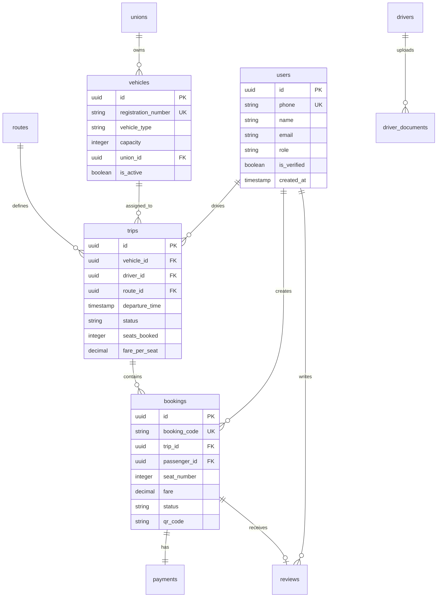
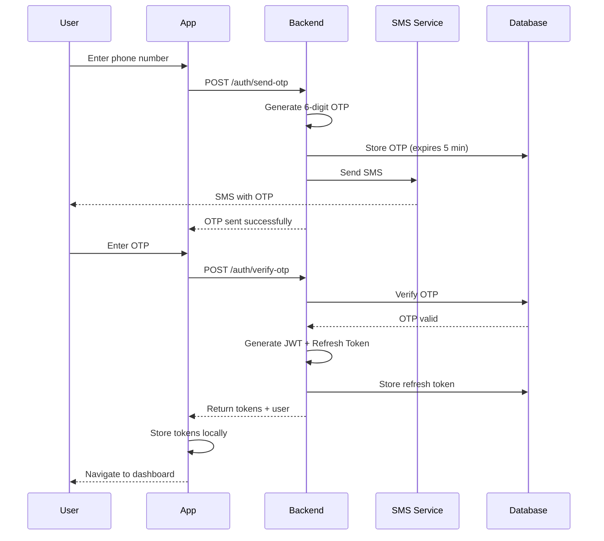
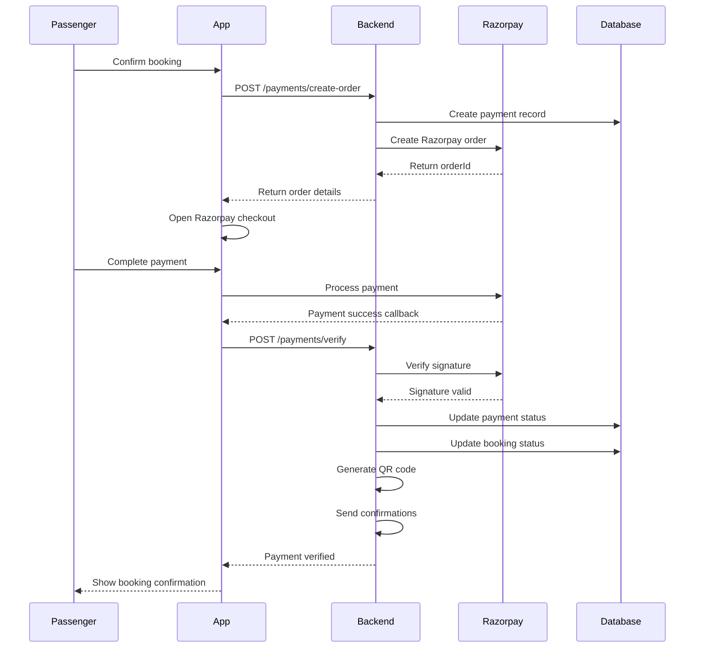

# 🔧 LuhaRide - Technical Specification Document

## 📋 Table of Contents
1. [System Architecture](#system-architecture)
2. [Database Design](#database-design)
3. [API Specification](#api-specification)
4. [Frontend Architecture](#frontend-architecture)
5. [Security & Authentication](#security--authentication)
6. [Real-time Features](#real-time-features)
7. [Payment System](#payment-system)
8. [Deployment Architecture](#deployment-architecture)

---

## 1. System Architecture

### 1.1 High-Level Architecture

```
┌─────────────────────────────────────────────────────────────┐
│                     CLIENT LAYER                             │
├─────────────────────────────────────────────────────────────┤
│  Flutter Mobile (iOS/Android)  │  Flutter Web (PWA)         │
└─────────────────┬───────────────┴────────────────────────────┘
                  │
                  ├── REST API (HTTPS)
                  └── WebSocket (WSS)
                  │
┌─────────────────┴───────────────────────────────────────────┐
│                   APPLICATION LAYER                          │
├─────────────────────────────────────────────────────────────┤
│  Express.js API Server  │  Socket.io Server                 │
│  - Authentication       │  - Real-time tracking             │
│  - Business Logic       │  - Live updates                   │
│  - Data Validation      │  - Notifications                  │
└─────────────────┬───────────────┬────────────────────────────┘
                  │               │
        ┌─────────┴──────┐   ┌───┴────────┐
        │                │   │            │
┌───────┴──────┐  ┌──────┴────┐  ┌────────┴───────┐
│ PostgreSQL   │  │ Redis     │  │ AWS S3         │
│ - Master DB  │  │ - Cache   │  │ - Documents    │
│ - ACID       │  │ - Session │  │ - Images       │
│ - PostGIS    │  │ - RT Data │  │                │
└──────────────┘  └───────────┘  └────────────────┘
                  │
        ┌─────────┴──────────────────────┐
        │                                │
┌───────┴─────────┐  ┌──────────────────┴───────┐
│ Google Maps API │  │ External Services        │
│ - Routing       │  │ - Razorpay (Payment)    │
│ - Geocoding     │  │ - Twilio (SMS)          │
│ - Directions    │  │ - Firebase (Push)       │
└─────────────────┘  └──────────────────────────┘
```

### 1.2 Technology Stack

| Layer | Technology | Version | Purpose |
|-------|-----------|---------|---------|
| **Mobile** | Flutter | 3.x | Cross-platform app |
| **Backend** | Node.js | 18+ | API server |
| **Framework** | Express.js | 4.x | Web framework |
| **Database** | PostgreSQL | 14+ | Primary data store |
| **Cache** | Redis | 7+ | Caching, sessions |
| **Real-time** | Socket.io | 4.x | WebSocket communication |
| **Storage** | AWS S3 | - | File storage |
| **Maps** | Google Maps | - | Location services |
| **Payment** | Razorpay | - | Payment gateway |
| **SMS** | Twilio | - | OTP & notifications |
| **Push** | Firebase FCM | - | Push notifications |

---

## 2. Database Design

### 2.1 Core Entity Relationship



### 2.2 Complete Table List

**Total: 15 Tables**

1. **users** - All user accounts (passengers, drivers, admins)
2. **unions** - Taxi union organizations
3. **vehicles** - Taxi vehicles (yellow plate only)
4. **routes** - Travel routes with lat/lng
5. **trips** - Scheduled trips
6. **bookings** - Individual seat bookings
7. **payments** - Payment transactions
8. **reviews** - Ratings and feedback
9. **driver_documents** - Verification documents
10. **location_history** - GPS tracking data
11. **sos_logs** - Emergency alerts
12. **notifications** - User notifications
13. **settings** - System configuration
14. **otp_verifications** - OTP management
15. **refresh_tokens** - JWT refresh tokens
16. **emergency_contacts** - User emergency contacts
17. **login_history** - Login audit trail

### 2.3 Data Types & Constraints

**Primary Keys:**
- All tables use `UUID` for better security and distribution
- Generated using `gen_random_uuid()`

**Phone Numbers:**
- Format: `VARCHAR(15)` (supports international)
- Validation: +[country code][number]
- Example: `+919876543210`

**Timestamps:**
- All tables have `created_at` (insertion time)
- Mutable tables have `updated_at` (auto-updated via trigger)

**Status Fields:**
- Use `CHECK` constraints for valid values
- Example: `status VARCHAR(20) CHECK (status IN ('pending', 'confirmed', 'completed'))`

**Money Fields:**
- Use `DECIMAL(10,2)` for currency
- Stores in rupees (not paise)
- Precision: 2 decimal places

**Location Fields:**
- `latitude DECIMAL(10, 8)` - 8 decimal precision
- `longitude DECIMAL(11, 8)` - 8 decimal precision
- Accuracy: ~1 meter

---

## 3. API Specification

### 3.1 API Design Principles

**RESTful Standards:**
- Resource-based URLs
- HTTP verbs (GET, POST, PUT, DELETE)
- Status codes (200, 201, 400, 401, 404, 500)
- JSON request/response

**Versioning:**
```
/api/v1/resource
/api/v2/resource (future)
```

**Response Format (Standard):**

```json
// Success Response
{
  "success": true,
  "data": {
    // Response data
  },
  "message": "Operation successful",
  "timestamp": "2026-02-11T10:30:00Z"
}

// Error Response
{
  "success": false,
  "error": {
    "code": "VALIDATION_ERROR",
    "message": "Invalid phone number",
    "details": {
      "field": "phone",
      "value": "123",
      "expected": "10 digit number"
    }
  },
  "timestamp": "2026-02-11T10:30:00Z"
}
```

### 3.2 Complete API Endpoints

**Authentication Module:**
```
POST   /api/v1/auth/send-otp
POST   /api/v1/auth/verify-otp
POST   /api/v1/auth/register
POST   /api/v1/auth/login
POST   /api/v1/auth/refresh-token
POST   /api/v1/auth/logout
GET    /api/v1/auth/me
```

**User Module:**
```
GET    /api/v1/users/profile
PUT    /api/v1/users/profile
POST   /api/v1/users/profile/image
GET    /api/v1/users/emergency-contacts
POST   /api/v1/users/emergency-contacts
DELETE /api/v1/users/emergency-contacts/:id
```

**Route Module:**
```
GET    /api/v1/routes
GET    /api/v1/routes/:id
GET    /api/v1/routes/search
GET    /api/v1/routes/popular
```

**Trip Module:**
```
POST   /api/v1/trips                    [Driver, Union]
GET    /api/v1/trips/available
GET    /api/v1/trips/:id
GET    /api/v1/trips/:id/seats
PUT    /api/v1/trips/:id/start          [Driver]
PUT    /api/v1/trips/:id/complete       [Driver]
PUT    /api/v1/trips/:id/cancel         [Driver, Union]
```

**Booking Module:**
```
POST   /api/v1/bookings/check-availability
POST   /api/v1/bookings/hold-seat
POST   /api/v1/bookings/create
GET    /api/v1/bookings/:id
GET    /api/v1/bookings/user/:userId
PUT    /api/v1/bookings/:id/cancel
POST   /api/v1/bookings/:id/board       [Driver]
GET    /api/v1/bookings/:id/qr-code
POST   /api/v1/bookings/verify-qr       [Driver]
```

**Payment Module:**
```
POST   /api/v1/payments/create-order
POST   /api/v1/payments/verify
POST   /api/v1/payments/failed
GET    /api/v1/payments/:bookingId/status
GET    /api/v1/payments/history
```

**Driver Module:**
```
GET    /api/v1/drivers/trips/upcoming
GET    /api/v1/drivers/trips/completed
POST   /api/v1/drivers/location
GET    /api/v1/drivers/earnings
POST   /api/v1/drivers/documents
GET    /api/v1/drivers/documents
GET    /api/v1/drivers/verification-status
```

**Union Module:**
```
GET    /api/v1/union/dashboard
GET    /api/v1/union/vehicles
POST   /api/v1/union/vehicles
PUT    /api/v1/union/vehicles/:id
GET    /api/v1/union/drivers
PUT    /api/v1/union/drivers/:id/verify
GET    /api/v1/union/analytics
GET    /api/v1/union/reports
```

**SOS Module:**
```
POST   /api/v1/sos/trigger
GET    /api/v1/sos/active                [Control Room]
PUT    /api/v1/sos/:id/respond           [Control Room]
PUT    /api/v1/sos/:id/resolve           [Control Room]
```

**Review Module:**
```
POST   /api/v1/reviews
GET    /api/v1/reviews/booking/:id
GET    /api/v1/reviews/driver/:id
```

**Total Endpoints: 50+**

---

## 4. Frontend Architecture

### 4.1 Flutter App Structure

**State Management: Provider Pattern**

```dart
// Core providers
- AuthProvider (user authentication state)
- UserProvider (user profile data)
- BookingProvider (booking flow state)
- TripProvider (trip search and selection)
- PaymentProvider (payment processing)
- LocationProvider (GPS tracking)
- ThemeProvider (app theme)
```

**Navigation: GoRouter**

```dart
final router = GoRouter(
  routes: [
    GoRoute(
      path: '/',
      builder: (context, state) => WelcomeScreen(),
    ),
    GoRoute(
      path: '/role-selection',
      builder: (context, state) => RoleSelectionScreen(),
    ),
    GoRoute(
      path: '/login',
      builder: (context, state) => LoginScreen(),
    ),
    // Passenger routes
    GoRoute(
      path: '/passenger',
      redirect: (context, state) => _authGuard(context),
      routes: [
        GoRoute(
          path: 'home',
          builder: (context, state) => PassengerHomeScreen(),
        ),
        GoRoute(
          path: 'search',
          builder: (context, state) => SearchTripsScreen(),
        ),
        GoRoute(
          path: 'booking/:id',
          builder: (context, state) => BookingDetailsScreen(
            bookingId: state.params['id']!,
          ),
        ),
      ],
    ),
    // Driver routes
    GoRoute(
      path: '/driver',
      routes: [
        GoRoute(
          path: 'dashboard',
          builder: (context, state) => DriverDashboardScreen(),
        ),
        // ... more routes
      ],
    ),
  ],
);
```

### 4.2 Design System

**Color Palette:**
```dart
class AppColors {
  // Primary colors
  static const primary = Color(0xFF2196F3);      // Blue
  static const secondary = Color(0xFF4CAF50);    // Green
  static const accent = Color(0xFFFF9800);       // Orange
  
  // Semantic colors
  static const success = Color(0xFF4CAF50);
  static const warning = Color(0xFFFF9800);
  static const error = Color(0xFFF44336);
  static const info = Color(0xFF2196F3);
  
  // Neutral colors
  static const textPrimary = Color(0xFF212121);
  static const textSecondary = Color(0xFF757575);
  static const background = Color(0xFFFAFAFA);
  static const surface = Color(0xFFFFFFFF);
  
  // Status colors
  static const pending = Color(0xFFFF9800);
  static const confirmed = Color(0xFF4CAF50);
  static const cancelled = Color(0xFFF44336);
}
```

**Typography:**
```dart
class AppTextStyles {
  static const heading1 = TextStyle(
    fontSize: 28,
    fontWeight: FontWeight.bold,
    color: AppColors.textPrimary,
  );
  
  static const heading2 = TextStyle(
    fontSize: 24,
    fontWeight: FontWeight.w600,
    color: AppColors.textPrimary,
  );
  
  static const body1 = TextStyle(
    fontSize: 16,
    fontWeight: FontWeight.normal,
    color: AppColors.textPrimary,
  );
  
  static const body2 = TextStyle(
    fontSize: 14,
    fontWeight: FontWeight.normal,
    color: AppColors.textSecondary,
  );
  
  static const caption = TextStyle(
    fontSize: 12,
    fontWeight: FontWeight.normal,
    color: AppColors.textSecondary,
  );
}
```

**Spacing System:**
```dart
class AppSpacing {
  static const xxs = 4.0;
  static const xs = 8.0;
  static const sm = 12.0;
  static const md = 16.0;
  static const lg = 24.0;
  static const xl = 32.0;
  static const xxl = 48.0;
}
```

---

## 5. Security & Authentication

### 5.1 Authentication Flow



### 5.2 Security Measures

**Password Hashing (if password auth used):**
- Algorithm: bcrypt
- Salt rounds: 12
- Never store plain text

**JWT Tokens:**
- Access Token: 7 days expiry
- Refresh Token: 30 days expiry
- Algorithm: HS256
- Payload: { userId, role, iat, exp }

**Rate Limiting:**
```javascript
// Per IP address
- OTP requests: 3 per hour
- Login attempts: 5 per 15 minutes
- API calls: 100 per 15 minutes

// Per user
- Failed OTP: 3 attempts, then block
- Failed login: 5 attempts, then 1 hour block
```

**Data Protection:**
- HTTPS only (TLS 1.3)
- Encrypted database connections
- Sensitive data encrypted at rest
- PII masked in logs
- GDPR compliant data handling

**API Security:**
- CORS properly configured
- Helmet.js for HTTP headers
- SQL injection prevention (parameterized queries)
- XSS protection
- CSRF tokens for web
- Input validation on all endpoints

---

## 6. Real-time Features

### 6.1 WebSocket Events

**Server Events (Backend → Client):**
```javascript
// Location updates
socket.emit('driver-location', {
  tripId: 'uuid',
  latitude: 30.3165,
  longitude: 78.0322,
  speed: 45.5,
  bearing: 180,
  timestamp: 1644567890000
});

// Booking updates
socket.emit('booking-status-changed', {
  bookingId: 'uuid',
  newStatus: 'confirmed',
  message: 'Payment successful'
});

// SOS alerts (Control room only)
socket.emit('sos-alert', {
  sosId: 'uuid',
  severity: 'high',
  location: { lat, lng },
  userDetails: { name, phone },
  tripDetails: { ... }
});

// Driver approaching
socket.emit('driver-arriving', {
  bookingId: 'uuid',
  estimatedArrival: '5 minutes'
});
```

**Client Events (Client → Server):**
```javascript
// Join tracking room
socket.emit('track-trip', {
  tripId: 'uuid',
  bookingId: 'uuid'
});

// Update location (Driver only)
socket.emit('location-update', {
  tripId: 'uuid',
  latitude: 30.3165,
  longitude: 78.0322,
  speed: 45.5,
  bearing: 180
});

// Start tracking (Driver)
socket.emit('start-tracking', {
  tripId: 'uuid',
  driverId: 'uuid'
});

// Stop tracking
socket.emit('stop-tracking', {
  tripId: 'uuid'
});
```

### 6.2 Real-time Performance

**Optimization Strategies:**

1. **Location Update Frequency:**
   - Moving: Every 10 seconds
   - Stationary: Every 30 seconds
   - High speed: Every 5 seconds

2. **Redis Caching:**
   - Current locations: TTL 1 hour
   - Session data: TTL 24 hours
   - Seat holds: TTL 5 minutes

3. **Database Writes:**
   - Persist location every 30 seconds (not every update)
   - Batch insert for performance
   - Archive old location data monthly

4. **WebSocket Rooms:**
   - Trip-specific rooms: `trip:{tripId}`
   - Control room: `control-room`
   - Driver notifications: `driver:{driverId}`

---

## 7. Payment System

### 7.1 Payment Flow



### 7.2 Payment States

```
Booking States:
pending → awaiting_payment → confirmed → boarded → completed

Payment States:
pending → processing → completed
         ↓
      failed → refund_initiated → refunded
```

### 7.3 Refund Policy

**Cancellation Windows:**
```javascript
const cancellationPolicy = {
  // More than 24 hours before: 90% refund
  moreThan24Hours: {
    refundPercentage: 90,
    processingFee: 10
  },
  
  // 6-24 hours before: 50% refund
  between6And24Hours: {
    refundPercentage: 50,
    processingFee: 50
  },
  
  // Less than 6 hours: No refund
  lessThan6Hours: {
    refundPercentage: 0,
    processingFee: 100
  },
  
  // Trip cancelled by driver/union: 100% refund
  tripCancelled: {
    refundPercentage: 100,
    processingFee: 0
  }
};
```

---

## 8. Deployment Architecture

### 8.1 Production Infrastructure

```
┌─────────────────────────────────────────┐
│          Cloudflare CDN                  │
│  - DNS, SSL, DDoS protection            │
└─────────────────┬───────────────────────┘
                  │
┌─────────────────┴───────────────────────┐
│       Load Balancer (Nginx)             │
│  - Round robin                          │
│  - Health checks                        │
└─────────────────┬───────────────────────┘
                  │
        ┌─────────┴──────────┐
        │                    │
┌───────┴──────┐    ┌────────┴──────┐
│ App Server 1 │    │ App Server 2  │
│ Node.js      │    │ Node.js       │
│ PM2          │    │ PM2           │
└───────┬──────┘    └────────┬──────┘
        │                    │
        └─────────┬──────────┘
                  │
    ┌─────────────┼─────────────┐
    │             │             │
┌───┴────┐  ┌────┴─────┐  ┌───┴────┐
│ PostgreSQL │ Redis      │ AWS S3   │
│ Primary   │ Cluster    │ Files    │
│ + Replica │           │          │
└──────────┘  └──────────┘  └────────┘
```

### 8.2 Server Specifications

**Development:**
- CPU: 2 cores
- RAM: 4 GB
- Storage: 50 GB SSD
- Bandwidth: 100 Mbps

**Production (Initial):**
- CPU: 4 cores
- RAM: 8 GB
- Storage: 100 GB SSD
- Bandwidth: 1 Gbps
- Estimated cost: ₹3,000-5,000/month

**Production (Scale):**
- CPU: 8+ cores
- RAM: 16+ GB
- Storage: 500 GB SSD
- Load balancer
- Database replica
- Redis cluster
- Estimated cost: ₹15,000-25,000/month

### 8.3 Monitoring & Logging

**Application Monitoring:**
- **Sentry**: Error tracking
- **New Relic** or **DataDog**: APM
- **Grafana**: Metrics visualization
- **Prometheus**: Metrics collection

**Logging:**
- **Winston**: Structured logging
- **CloudWatch** or **ELK Stack**: Log aggregation
- Log levels: error, warn, info, debug
- Retention: 30 days

**Metrics to Track:**
- Response time (p50, p95, p99)
- Error rate
- Request rate
- Database query time
- Cache hit rate
- Active connections
- Memory usage
- CPU usage

---

## 9. Development Workflow

### 9.1 Git Branching Strategy

```
main (production)
  ↑
  └── develop (staging)
        ↑
        ├── feature/auth-system
        ├── feature/booking-system
        ├── feature/payment-integration
        └── bugfix/booking-race-condition
```

**Branch naming:**
- `feature/feature-name` - New features
- `bugfix/bug-description` - Bug fixes
- `hotfix/critical-fix` - Production hotfixes
- `refactor/code-improvement` - Code refactoring

### 9.2 Commit Convention

```
type(scope): subject

Examples:
feat(auth): add OTP verification
fix(booking): prevent double booking race condition
refactor(api): improve error handling
docs(readme): update setup instructions
test(booking): add unit tests for seat selection
```

### 9.3 Code Review Checklist

**Before Merge:**
- [ ] Code follows style guide
- [ ] Tests added/updated
- [ ] No console.log in production code
- [ ] Error handling implemented
- [ ] Documentation updated
- [ ] No hardcoded credentials
- [ ] Performance considered
- [ ] Security reviewed

---

## 10. Performance Benchmarks

### 10.1 Target Metrics

| Metric | Target | Critical |
|--------|--------|----------|
| API response time (p95) | <200ms | <500ms |
| Database query time | <50ms | <200ms |
| Page load time | <2s | <5s |
| Time to interactive | <3s | <7s |
| WebSocket latency | <100ms | <300ms |
| Concurrent users | 1000+ | 500+ |
| Requests per second | 100+ | 50+ |

### 10.2 Optimization Techniques

**Backend:**
- Connection pooling (PostgreSQL)
- Query optimization (indexes, explain analyze)
- Response caching (Redis)
- Compression (gzip)
- CDN for static assets
- Database query batching
- Lazy loading

**Mobile:**
- Image caching
- Lazy loading lists
- Pagination (50 items per page)
- Debouncing search
- Optimistic UI updates
- Background data sync
- Offline-first architecture

---

## 11. Error Handling

### 11.1 Error Codes

```javascript
const ErrorCodes = {
  // Authentication (1xxx)
  INVALID_CREDENTIALS: { code: 1001, message: 'Invalid credentials', status: 401 },
  TOKEN_EXPIRED: { code: 1002, message: 'Token expired', status: 401 },
  INVALID_OTP: { code: 1003, message: 'Invalid or expired OTP', status: 400 },
  ACCOUNT_BLOCKED: { code: 1004, message: 'Account temporarily blocked', status: 403 },
  
  // Booking (2xxx)
  SEAT_NOT_AVAILABLE: { code: 2001, message: 'Selected seats not available', status: 400 },
  BOOKING_NOT_FOUND: { code: 2002, message: 'Booking not found', status: 404 },
  BOOKING_EXPIRED: { code: 2003, message: 'Booking hold expired', status: 400 },
  MAX_SEATS_EXCEEDED: { code: 2004, message: 'Maximum 4 seats per booking', status: 400 },
  
  // Payment (3xxx)
  PAYMENT_FAILED: { code: 3001, message: 'Payment processing failed', status: 400 },
  INVALID_SIGNATURE: { code: 3002, message: 'Invalid payment signature', status: 400 },
  REFUND_FAILED: { code: 3003, message: 'Refund processing failed', status: 500 },
  
  // System (5xxx)
  SERVER_ERROR: { code: 5000, message: 'Internal server error', status: 500 },
  DATABASE_ERROR: { code: 5001, message: 'Database operation failed', status: 500 },
  SERVICE_UNAVAILABLE: { code: 5003, message: 'Service temporarily unavailable', status: 503 },
};
```

### 11.2 Error Response Format

```javascript
class ApiError extends Error {
  constructor(code, message, details = null, status = 500) {
    super(message);
    this.code = code;
    this.status = status;
    this.details = details;
  }
  
  toJSON() {
    return {
      success: false,
      error: {
        code: this.code,
        message: this.message,
        details: this.details,
      },
      timestamp: new Date().toISOString()
    };
  }
}

// Usage
throw new ApiError(
  ErrorCodes.SEAT_NOT_AVAILABLE.code,
  ErrorCodes.SEAT_NOT_AVAILABLE.message,
  { requestedSeats: [1, 2], availableSeats: [3, 4, 5] },
  400
);
```

---

## 12. Data Models

### 12.1 TypeScript Interfaces

```typescript
// Shared type definitions
interface User {
  id: string;
  phone: string;
  name: string;
  email?: string;
  role: 'passenger' | 'driver' | 'union_admin';
  isVerified: boolean;
  profileImageUrl?: string;
  createdAt: Date;
  updatedAt: Date;
}

interface Vehicle {
  id: string;
  registrationNumber: string;
  vehicleType: string;
  capacity: number;
  unionId: string;
  currentDriverId?: string;
  isActive: boolean;
  plateType: 'yellow';
  permitNumber: string;
  permitExpiry: Date;
  insuranceNumber: string;
  insuranceExpiry: Date;
}

interface Route {
  id: string;
  name: string;
  fromLocation: string;
  toLocation: string;
  fromLat: number;
  fromLng: number;
  toLat: number;
  toLng: number;
  distanceKm: number;
  estimatedDurationMinutes: number;
  baseFare: number;
  isPopular: boolean;
}

interface Trip {
  id: string;
  vehicleId: string;
  driverId: string;
  routeId: string;
  departureTime: Date;
  status: 'scheduled' | 'boarding' | 'in_progress' | 'completed' | 'cancelled';
  seatsBooked: number;
  totalCapacity: number;
  farePerSeat: number;
  
  // Relations
  vehicle?: Vehicle;
  driver?: User;
  route?: Route;
  bookings?: Booking[];
}

interface Booking {
  id: string;
  bookingCode: string;
  tripId: string;
  passengerId: string;
  seatNumber: number;
  fare: number;
  status: 'pending' | 'confirmed' | 'boarded' | 'completed' | 'cancelled';
  qrCode?: string;
  bookedAt: Date;
  
  // Relations
  trip?: Trip;
  passenger?: User;
  payment?: Payment;
}

interface Payment {
  id: string;
  bookingId: string;
  amount: number;
  paymentMethod: 'razorpay' | 'cash' | 'upi';
  razorpayOrderId?: string;
  razorpayPaymentId?: string;
  status: 'pending' | 'completed' | 'failed' | 'refunded';
  paidAt?: Date;
}
```

### 12.2 Dart Models (Flutter)

```dart
// mobile/lib/data/models/user_model.dart
class User {
  final String id;
  final String phone;
  final String name;
  final String? email;
  final UserRole role;
  final bool isVerified;
  final String? profileImageUrl;
  final DateTime createdAt;
  
  User({
    required this.id,
    required this.phone,
    required this.name,
    this.email,
    required this.role,
    required this.isVerified,
    this.profileImageUrl,
    required this.createdAt,
  });
  
  factory User.fromJson(Map<String, dynamic> json) {
    return User(
      id: json['id'],
      phone: json['phone'],
      name: json['name'],
      email: json['email'],
      role: UserRole.values.byName(json['role']),
      isVerified: json['is_verified'],
      profileImageUrl: json['profile_image_url'],
      createdAt: DateTime.parse(json['created_at']),
    );
  }
  
  Map<String, dynamic> toJson() {
    return {
      'id': id,
      'phone': phone,
      'name': name,
      'email': email,
      'role': role.name,
      'is_verified': isVerified,
      'profile_image_url': profileImageUrl,
      'created_at': createdAt.toIso8601String(),
    };
  }
}

enum UserRole {
  passenger,
  driver,
  union_admin
}
```

---

## 13. Feature Flags

### 13.1 Progressive Rollout

```javascript
// backend/src/config/features.js
const features = {
  // Core features (always on)
  BOOKING_ENABLED: true,
  PAYMENT_ENABLED: true,
  
  // Beta features (controlled rollout)
  CARPOOLING_ENABLED: process.env.FEATURE_CARPOOLING === 'true',
  TOUR_PACKAGES_ENABLED: false,
  MULTI_STOP_BOOKING: false,
  
  // Regional features
  SMS_BACKUP_BOOKING: true,  // For low internet areas
  CASH_PAYMENT: true,        // Offline payments
  
  // Advanced features
  AI_ROUTE_OPTIMIZATION: false,
  VOICE_BOOKING: false,
  AR_NAVIGATION: false,
};

module.exports = features;
```

---

## 14. Notification System

### 14.1 Notification Types

**Push Notifications (Firebase FCM):**
```javascript
const notificationTemplates = {
  BOOKING_CONFIRMED: {
    title: 'Booking Confirmed',
    body: 'Your seat {seatNumber} is confirmed for {route}',
    action: 'VIEW_BOOKING',
    priority: 'high'
  },
  
  DRIVER_ARRIVING: {
    title: 'Driver Arriving',
    body: 'Driver will arrive in {eta} minutes',
    action: 'TRACK_RIDE',
    priority: 'high'
  },
  
  TRIP_STARTED: {
    title: 'Trip Started',
    body: 'Your journey has begun. Track live location.',
    action: 'TRACK_RIDE',
    priority: 'high'
  },
  
  PAYMENT_SUCCESS: {
    title: 'Payment Successful',
    body: 'Payment of ₹{amount} received',
    action: 'VIEW_RECEIPT',
    priority: 'normal'
  },
  
  SOS_ALERT: {
    title: 'EMERGENCY ALERT',
    body: 'SOS triggered by {name}',
    action: 'VIEW_SOS',
    priority: 'critical'
  }
};
```

**SMS Notifications (Twilio):**
```javascript
const smsTemplates = {
  OTP: 'Your LuhaRide OTP is {otp}. Valid for 5 minutes. Do not share.',
  
  BOOKING_CONFIRMED: 'Booking {code} confirmed! Seat {seat}, {route}, {time}. Show QR code to driver.',
  
  DRIVER_DETAILS: 'Your driver: {name}, Vehicle: {number}. Track: {link}',
  
  SOS_EMERGENCY: 'EMERGENCY: {name} triggered SOS. Location: {link}. Contact: {phone}',
  
  TRIP_REMINDER: 'Reminder: Your trip to {destination} departs in 2 hours. Reach {pickup} by {time}.'
};
```

---

## 15. Backup & Recovery

### 15.1 Backup Strategy

**Database Backups:**
```bash
# Daily automated backup
pg_dump -h localhost -U postgres luharide | gzip > backup_$(date +%Y%m%d).sql.gz

# Retention policy
- Daily backups: 7 days
- Weekly backups: 4 weeks
- Monthly backups: 12 months
```

**Redis Backups:**
```bash
# RDB snapshot every 5 minutes if changes
save 300 10

# AOF for durability
appendonly yes
appendfsync everysec
```

**File Storage:**
- S3 versioning enabled
- Lifecycle policy (archive old documents after 1 year)
- Cross-region replication

### 15.2 Disaster Recovery

**RTO (Recovery Time Objective):** 4 hours  
**RPO (Recovery Point Objective):** 1 hour

**Recovery Procedures:**
1. Restore database from latest backup
2. Restore Redis from AOF/RDB
3. Restore application server (Docker)
4. Verify data integrity
5. Resume operations

---

## 16. Compliance & Legal

### 16.1 Data Privacy (DPDP Act Compliance)

**Personal Data Collected:**
- Phone number (required)
- Name (required)
- Email (optional)
- Location (during trip only)
- Payment details (encrypted, not stored)

**Data Retention:**
- Active users: Indefinitely
- Inactive users (2 years): Anonymized
- Trip history: 3 years
- Location history: 90 days
- Payment records: 7 years (tax compliance)

**User Rights:**
- Right to access data
- Right to delete account
- Right to export data
- Right to correct information

### 16.2 Motor Vehicle Act Compliance

**Verification Requirements:**
- Only yellow plate vehicles
- Valid commercial permits
- Commercial insurance
- Fitness certificate
- PUC certificate
- Driver commercial license
- Police verification

**Document Expiry Monitoring:**
```javascript
// Daily cron job
cron.schedule('0 0 * * *', async () => {
  // Check document expiries
  const expiringDocs = await DriverDocument.findAll({
    where: {
      expiry_date: {
        [Op.between]: [
          new Date(),
          new Date(Date.now() + 30 * 24 * 60 * 60 * 1000) // Next 30 days
        ]
      },
      is_verified: true
    }
  });
  
  // Alert drivers and admins
  for (const doc of expiringDocs) {
    await NotificationService.send(
      doc.driver_id,
      'Document Expiring Soon',
      `Your ${doc.document_type} expires on ${doc.expiry_date}. Please renew.`
    );
  }
});
```

---

## 17. Scalability Plan

### 17.1 Horizontal Scaling

**Application Servers:**
- Stateless design (JWT, no server sessions)
- Load balancer distributes traffic
- Auto-scaling based on CPU/memory

**Database:**
- Read replicas for analytics
- Connection pooling
- Query optimization
- Partitioning (location_history by date)

**Caching:**
- Redis cluster (3 nodes minimum)
- Cache warming strategy
- Cache invalidation on updates

### 17.2 Growth Projections

**Month 1 (Pilot):**
- Users: 500
- Daily requests: 5,000
- Database: 10 GB
- Infrastructure: 1 server

**Month 6:**
- Users: 10,000
- Daily requests: 100,000
- Database: 50 GB
- Infrastructure: 2 app servers + load balancer

**Month 12:**
- Users: 100,000
- Daily requests: 1,000,000
- Database: 200 GB
- Infrastructure: 5 app servers + DB replica

---

## 18. Development Standards

### 18.1 Code Style

**Backend (JavaScript/Node.js):**
- ESLint configuration
- Airbnb style guide
- 2 spaces indentation
- Single quotes
- Semicolons required

**Frontend (Dart/Flutter):**
- Effective Dart style guide
- dartfmt auto-formatting
- 2 spaces indentation
- Prefer const constructors

### 18.2 File Naming

**Backend:**
- Files: camelCase.js (userController.js)
- Classes: PascalCase (UserController)
- Functions: camelCase (getUserById)
- Constants: UPPER_SNAKE_CASE (MAX_SEATS)

**Flutter:**
- Files: snake_case.dart (user_model.dart)
- Classes: PascalCase (UserModel)
- Variables: camelCase (currentUser)
- Constants: lowerCamelCase (maxSeats)

---

## 19. Testing Coverage Goals

| Module | Unit Tests | Integration Tests | E2E Tests |
|--------|-----------|-------------------|-----------|
| Authentication | 90%+ | 80%+ | 100% |
| Booking | 95%+ | 90%+ | 100% |
| Payment | 90%+ | 95%+ | 100% |
| Tracking | 80%+ | 85%+ | 90% |
| Admin | 70%+ | 75%+ | 80% |

**Overall Target: 85%+ code coverage**

---

## 20. Budget Estimate

### 20.1 Development Costs

**Team (6 months):**
- 1 Backend Developer: ₹50,000/month × 6 = ₹3,00,000
- 1 Frontend Developer: ₹50,000/month × 6 = ₹3,00,000
- 1 UI/UX Designer: ₹30,000/month × 3 = ₹90,000
- **Total Development:** ₹6,90,000

**OR Solo Developer:**
- 6 months full-time
- Opportunity cost calculation

### 20.2 Operational Costs (Monthly)

**Infrastructure:**
- Server: ₹3,000-5,000
- Database: ₹2,000-3,000
- Storage (S3): ₹500-1,000
- CDN: ₹500-1,000
- **Subtotal:** ₹6,000-10,000/month

**External Services:**
- Google Maps API: ₹2,000-5,000 (depends on usage)
- Razorpay: 2% per transaction
- Twilio SMS: ₹0.50/SMS × 1000 = ₹500
- Firebase: Free tier initially
- **Subtotal:** ₹3,000-6,000/month

**Legal & Compliance:**
- Aggregator license: ₹50,000 (one-time)
- Legal consultation: ₹25,000 (one-time)
- Insurance: ₹10,000/year

**Marketing (Launch):**
- Initial campaign: ₹50,000-1,00,000
- Ongoing: ₹20,000/month

**Total Monthly Operating Cost:** ₹10,000-20,000

---

**This is your complete technical blueprint. Ready to start Phase 1? 🚀**
